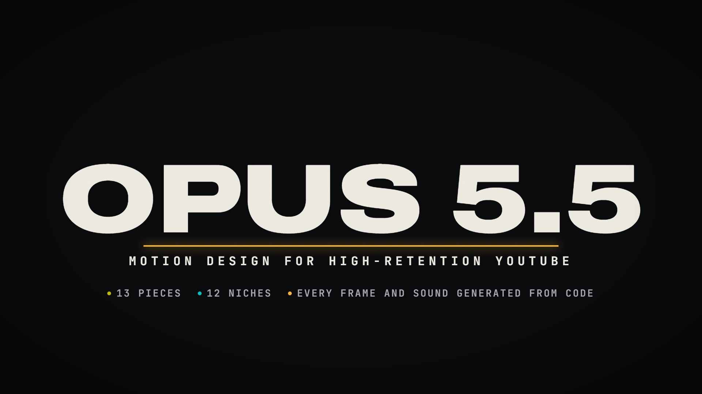
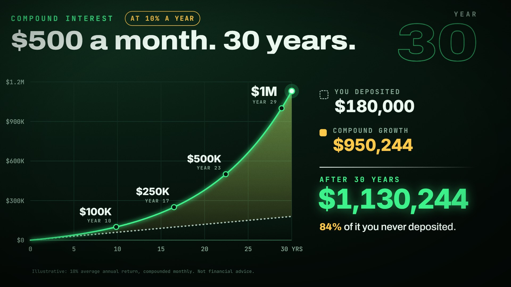
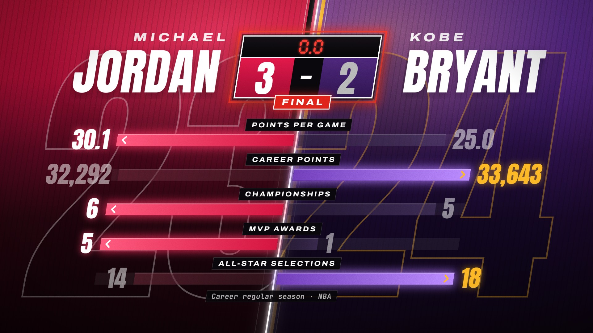
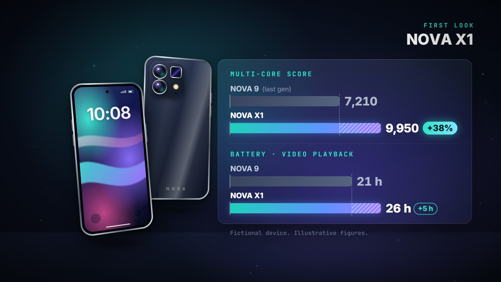
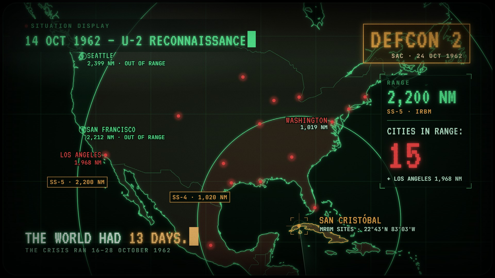
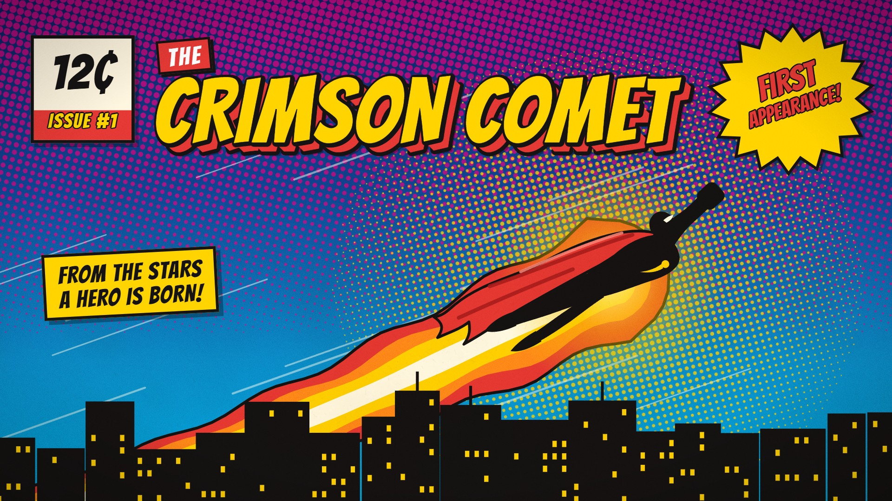

# Styles

Every style is a reusable, param-driven motion piece. Pick one by niche here or in
[docs/NICHE-MAP.md](../docs/NICHE-MAP.md); each card has its params, examples and render commands.

_Generated by `node tools/catalog.mjs`._

| | style | primary niches | also fits | length | examples |
|---|---|---|---|---:|---:|
|  | **[Bars & Tone Open](reel-open-bars/README.md)** `reel-open-bars` | Showreel / portfolio open · Channel intro | Episode cold open · Documentary title card · Tech & broadcast channels · Retro / VHS themes · Course or series opener | 3.6 s | 1 |
|  | **[Kinetic Captions](captions-kinetic/README.md)** `captions-kinetic` | Podcast clips · Talking-head YouTube · Motivation & self-improvement | Fitness coaching · Business & entrepreneurship · Sales training · Interview clips · Sports mindset · Sermon & faith clips · Creator advice | 8.0 s | 1 |
|  | **[Growth Curve](finance-growth-curve/README.md)** `finance-growth-curve` | Personal finance · Investing · Retirement planning | Crypto (DCA) · Real estate · Business revenue growth · Creator income · Savings challenges · Any "this compounds over time" story | 8.0 s | 1 |
|  | **[Case Board](truecrime-case-board/README.md)** `truecrime-case-board` | True crime · Cold cases · Missing persons | Unsolved mysteries · Paranormal & UFO · Heists & fraud · Conspiracy & cover-ups · Historical mysteries · Mystery podcasts · Crime fiction & ARGs | 8.0 s | 1 |
|  | **[Loot Reveal](gaming-loot-reveal/README.md)** `gaming-loot-reveal` | Gaming · RPG & looter games · Game item & patch breakdowns | Trading-card pack openings · Mobile gacha pulls · Fitness app rank-ups · Esports rank reveals · Creator milestones · Study & habit streaks · Fantasy sports player cards | 7.0 s | 1 |
|  | **[Campaign Map](history-campaign-map/README.md)** `history-campaign-map` | Ancient history · Military history · History explainers | Napoleonic & modern campaigns · Data storytelling (Minard-style) · Exploration & expeditions · Polar & mountaineering disasters · Historical migrations · Trade routes & caravans · Road-trip & travel recaps | 9.0 s | 1 |
|  | **[Head to Head](sports-head-to-head/README.md)** `sports-head-to-head` | Sports · Basketball · GOAT debates | Tennis · American football · Soccer · Boxing & MMA tale of the tape · Formula 1 drivers · Esports players · Tech spec face-offs | 7.5 s | 1 |
|  | **[True-Scale Zoom](science-scale-zoom/README.md)** `science-scale-zoom` | Space & astronomy · Science explainers · Science education | Stars & stellar astronomy · Planetary science · Moons & dwarf planets · Exoplanets · Kids science & STEM · Sci-fi worldbuilding | 9.0 s | 1 |
|  | **[Scroll Reveal](faith-scroll-reveal/README.md)** `faith-scroll-reveal` | Faith & Bible history · Biblical archaeology · Ancient history | Classics & ancient literature · Jewish history & Torah · Church history & Latin texts · Mythology & epic poetry · Manuscript & book history · Historical documents & charters · Ancient philosophy quotes | 8.0 s | 1 |
|  | **[Spec Callouts](tech-spec-callouts/README.md)** `tech-spec-callouts` | Tech reviews · Smartphone launches · Spec breakdowns | Phone vs phone comparisons · Mobile gaming · Budget tech · Camera phone tests · Tech news recaps · Consumer tech explainers | 7.5 s | 1 |
|  | **[Range Rings](coldwar-range-rings/README.md)** `coldwar-range-rings` | Cold War history · Military & geopolitics · Nuclear history | Volcano & disaster explainers · Explosions & shockwaves · Current-events missile ranges · Aviation & drone range · Radio & broadcast coverage · Earthquake reach | 8.5 s | 1 |
|  | **[Recipe Card](cooking-recipe-card/README.md)** `cooking-recipe-card` | Cooking · Family recipes · Retro & vintage food | Baking · Food history · Heirloom & grandma recipes · Comfort food · Budget home cooking · Holiday baking | 7.5 s | 1 |
|  | **[Panel Slam](comics-panel-slam/README.md)** `comics-panel-slam` | Comics & pop culture · Superhero film & TV · Comic book history | Movie trailer breakdowns · Anime & manga recaps · Video game story recaps · Webcomic & indie comic promos · Origin-story explainers · Sports hype intros · Personalized hero intros | 7.0 s | 1 |
|  | **[Subscribe Card](cta-subscribe/README.md)** `cta-subscribe` | Universal CTA · Channel end screens · Creator branding | Cooking channels · Gaming channels · Tech reviews · Podcasts (follow) · Newsletters · Music artists (follow) · Fitness coaches · Education channels | 5.5 s | 1 |
|  | **[Bars & Tone Close](reel-close-bars/README.md)** `reel-close-bars` | Showreel / portfolio end card · Channel outro | Episode end card · Series or course wrap-up · Credits roll-call · Tech & broadcast channels · Retro / VHS themes | 4.6 s | 1 |
