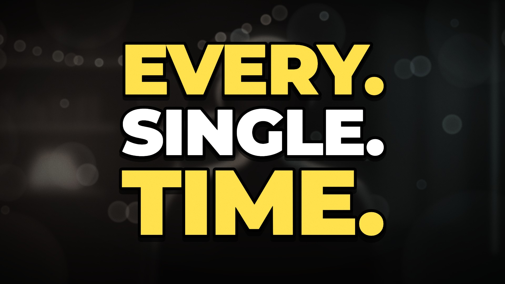
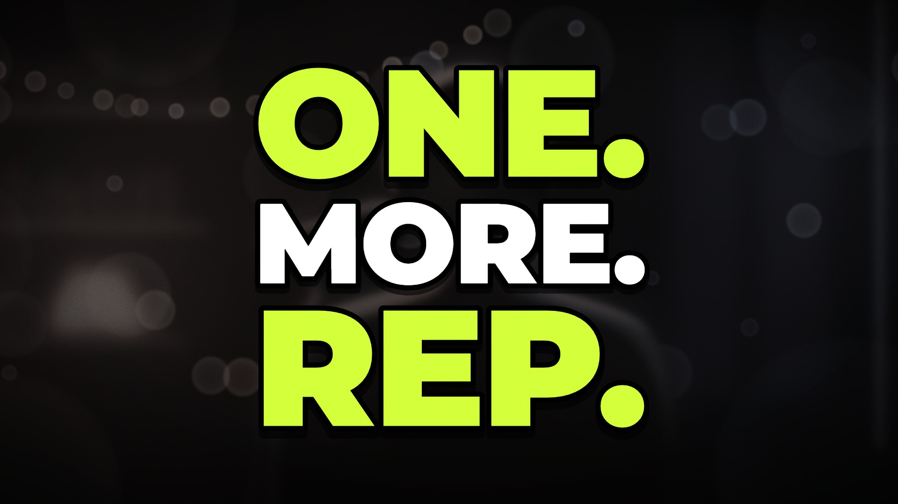

# Kinetic Captions · `captions-kinetic`



Word-synced captions pop onto simulated, defocused podcast footage one word at a time. The active word
lights up and nudges its neighbours aside. Keywords get their own treatment: a red hit word shakes the
frame and punches the camera in, a payoff word glows with a drawn icon, and a struck word is crossed out
while the word it loses to lights up again. The frame then dims for the pattern interrupt: one giant word
per beat, each slammed in with a flash and a boom, before all of them stamp back into a quotable stack
that holds as the thumbnail.

<!-- catalog:start · generated by tools/catalog.mjs from style.js; edit the style, then rerun -->
| | |
|---|---|
| **Style id** | `captions-kinetic` |
| **Primary niches** | Podcast clips · Talking-head YouTube · Motivation & self-improvement |
| **Also fits** | Fitness coaching · Business & entrepreneurship · Sales training · Interview clips · Sports mindset · Sermon & faith clips · Creator advice |
| **Length** | 8.0 s · poster frame 6.9 s · 29 sound cues |
| **Palette** | `#FFE14D` `#FF3B3B` `#15100C` |
| **Techniques** | Word-synced kinetic captions · Keyword colour + footage punch-in · Giant-word pattern interrupt |

**Why it retains:** A caption lands on every word so the eye reads ahead of the ear; colour-coded keywords and punch-ins flag the ideas, and the giant-word slams break the rhythm right where attention would sag.

**Retention beats** (the editing decisions, in order)

| t | beat |
|---:|---|
| 0.35 s | Each word lands on its syllable; the active word turns yellow |
| 0.95 s | Keyword gets colour, a shake and a punch-in on the footage |
| 2.80 s | Payoff word goes green with an icon so it reads at a glance |
| 4.75 s | Strike-through turns the line into a before-and-after |
| 5.10 s | Pattern interrupt: one giant word per beat resets attention |
| 6.60 s | Words settle into a quotable stack that doubles as the thumbnail |

**Showcase card:** Podcast & Talking Head · *Kinetic Captions*  
**Facts:** Fictional script; word timings authored at about three words per second.

**Examples**

| params | niche | title | frame |
|---|---|---|---|
| defaults | Podcast & Talking Head | Kinetic Captions |  |
| [`examples/fitness-coach.json`](examples/fitness-coach.json) | Fitness coaching | One More Rep |  |

**Render**

```bash
node tools/render.mjs sheet captions-kinetic
node tools/render.mjs video captions-kinetic --params styles/captions-kinetic/examples/fitness-coach.json
```

<details><summary>Default params (copy into a params file and change what you need)</summary>

```json
{
  "pages": [
    [
      { "text": "MOST", "t": 0.35, "dur": 0.22, "syl": 1, "loud": 0.75 },
      { "text": "PEOPLE", "t": 0.6, "dur": 0.3, "syl": 2, "loud": 0.7 },
      { "text": "QUIT", "t": 0.95, "kw": "hit", "dur": 0.3, "syl": 1, "loud": 1 }
    ],
    [
      { "text": "RIGHT", "t": 1.5, "dur": 0.22, "syl": 1, "loud": 0.72 },
      { "text": "BEFORE", "t": 1.75, "dur": 0.34, "syl": 2, "loud": 0.72 }
    ],
    [
      { "text": "IT", "t": 2.15, "dur": 0.14, "syl": 1, "loud": 0.6 },
      { "text": "STARTS", "t": 2.35, "dur": 0.36, "syl": 1, "loud": 0.75 },
      { "text": "WORKING.", "t": 2.8, "kw": "win", "icon": "arrow", "dur": 0.44, "syl": 2, "loud": 0.95 }
    ],
    [
      { "text": "DISCIPLINE", "t": 3.6, "kw": "keep", "dur": 0.42, "syl": 3, "loud": 0.85 },
      { "text": "BEATS", "t": 4.05, "dur": 0.26, "syl": 1, "loud": 0.75 },
      {
        "text": "MOTIVATION",
        "t": 4.35,
        "kw": "strike",
        "newLine": true,
        "dur": 0.52,
        "syl": 4,
        "loud": 0.85
      }
    ]
  ],
  "slams": [
    { "text": "EVERY.", "t": 5.1, "kw": "accent", "dur": 0.36, "syl": 2, "loud": 1 },
    { "text": "SINGLE.", "t": 5.6, "dur": 0.38, "syl": 2, "loud": 1 },
    { "text": "TIME.", "t": 6.1, "kw": "accent", "dur": 0.46, "syl": 1, "loud": 1 }
  ],
  "wordsPerSecond": 2.6,
  "uppercase": true,
  "footage": {
    "show": true,
    "wall": ["#26170d", "#170f0b", "#0b1113", "#06171a"],
    "warm": "#FF8A3A",
    "cool": "#1CC4BE"
  },
  "padNotes": [110, 164.8, 220, 261.6],
  "slamPadNotes": [98, 146.8, 196, 233.1],
  "droneHz": 55,
  "colors": {
    "accent": "#FFE14D",
    "hit": "#FF3B3B",
    "win": "#3DFF8A",
    "text": "#FFFFFF",
    "struck": "#C9C9CF"
  }
}
```
</details>
<!-- catalog:end -->

## Params

Every effect is timed from the word table: colours, shakes, punch-ins, the speech meter's tint and every
sound follow the word they belong to. The piece lasts until the last slam + 1.9 s (at least 5 s), so the
defaults run 8.0 s.

| key | default | what it controls · limits |
|---|---|---|
| `pages` | 4 pages, 11 words | caption pages in order. Each page is a list of words shown together. 1–8 pages and up to 8 words per page (extra ones are dropped); 2–4 words per page reads best. A plain string is shorthand for `{ "text": … }`, and `{ "words": [...] }` works as a page too |
| `pages[][].text` | `MOST`, `PEOPLE`, … | the word, set in Montserrat 900. A line wider than 1600 px breaks once at its most balanced point (up to 3 lines per page), then the whole page scales down to fit |
| `pages[][].t` | `0.35`, `0.60`, … | onset in seconds (use your transcript's word timestamps). Omit it to auto-time at `wordsPerSecond`. Times never run backwards: each word lands at least 0.12 s after the previous one |
| `pages[][].kw` | `hit` on QUIT, `win` on WORKING., `keep` on DISCIPLINE, `strike` on MOTIVATION | keyword role. `hit`: red, hard pop, jitter, shake, red edge pulse, camera punch-in, thud. `win`: stays green with a glow. Both tint the speech meter while their page is up. `strike`: a red bar crosses it out at `strikeAt` and it greys out. `keep`: pops on its onset and lights up again 0.05 s after a later strike on its page. Leave it out for a plain word: accent while spoken, then text colour |
| `pages[][].icon` | `arrow` on WORKING. | `arrow` (trend up) or `check`, drawn 0.07 s after the word in the word's colour, with a blip |
| `pages[][].newLine` | `true` on MOTIVATION | starts the next line of the page (up to 3 lines) |
| `pages[][].strikeAt` | t + 0.4 s | when the strike lands on a `strike` word. By default it lands 0.4 s after the word, and at least 0.25 s before the page leaves |
| `pages[][].dur`, `.syl`, `.loud` | set for every default word | spoken length (s), syllables and loudness (0–1). They drive the speech meter and the speaker's head nods. When omitted they are estimated from the word and its role |
| `slams` | EVERY. · SINGLE. · TIME. at 5.10 / 5.60 / 6.10 | the giant words, one per beat. 0–4 (3 is the showcase rhythm). Each slam is set to the same stack width, so short words come out taller. A stack taller than 760 px scales down as a whole. Each slam hides when the next one lands, and 0.48 s after the last one they all stamp back into the stack. With `[]` the last caption page holds to the end |
| `slams[].text`, `.t` | see above | the word and its beat. Omitted times follow the showcase rhythm: 0.75 s after the last caption, then every 0.5 s |
| `slams[].kw` | `accent`, none, `accent` | slam colour: `accent`, `hit`, `win`, or none for the text colour. Coloured slams also tint the meter for half a second |
| `slams[].dur`, `.syl`, `.loud` | set | speech model, as for caption words |
| `wordsPerSecond` | `2.6` | pace for words without `t`. The gap after a word grows with its syllables, and each new page adds 0.2 s |
| `uppercase` | `true` | uppercases every word. With `false`, keep the slams uppercase: the stack is laid out on cap height |
| `footage.show` | `true` | the simulated podcast set (bokeh, practicals, backlit speaker with headphones and mic). `false` gives captions on the plain `bg`. Alpha renders (`--alpha`) always skip it, so the captions can go over real footage |
| `footage.wall` | 4 dark stops | back-wall grade, left to right (4 stops sit at 0 / 42 / 70 / 100 %) |
| `footage.warm` | `#FF8A3A` | the warm key light: lamp, string lights, shelf strips and warm rim. Every warm tint in the set shifts by the same offset |
| `footage.cool` | `#1CC4BE` | the cool side: LED wall, acoustic panels and cool rim, shifted the same way |
| `padNotes` | `[110, 164.8, 220, 261.6]` | the bed under the captions (Hz), a minor chord |
| `slamPadNotes` | `[98, 146.8, 196, 233.1]` | the bed under the slams (Hz) |
| `droneHz` | `55` | the sub drone under the whole piece |
| `colors.accent` | `#FFE14D` | the active word, `keep` re-light, `accent` slams |
| `colors.hit` | `#FF3B3B` | hit words, their glow and edge pulse, the strike bar |
| `colors.win` | `#3DFF8A` | win words, their glow and icon |
| `colors.text` | `#FFFFFF` | settled words, plain slams, the idle meter |
| `colors.struck` | `#C9C9CF` | a struck word after the strike |
| `palette`, `meta`, `bg` | from style.js | portfolio swatches, card copy (`niche`, `title`, `why`, `facts`), page background |

## Adapting it

- **Fitness coaching** ([`examples/fitness-coach.json`](examples/fitness-coach.json)): the myth word is
  the `hit` ("OVERRATED."), the fix is the `win` with a `check`, a `keep`/`strike` pair makes the
  before-and-after ("PROGRESS BEATS / ~~PERFECTION~~") and the slams are the mantra ("ONE. MORE. REP.").
  A volt accent with a cyan win, and `footage.cool: "#2E7BFF"` for a blue gym LED.
- **Business or entrepreneur podcast:** `hit` on the failure word ("MOST STARTUPS DIE"), `win` +
  `arrow` on the growth word, `keep`/`strike` for the lesson ("CASH FLOW BEATS / FUNDING"), and slams
  like "SHIP. IT. TODAY.". A calmer grade reads as a studio: `footage.warm: "#FFB070"`,
  `footage.cool: "#4AA8FF"`.
- **Sales training:** "NOBODY BUYS / FEATURES." (`hit`), "THEY BUY / OUTCOMES." (`win` + `check`),
  "LISTENING BEATS / PITCHING" (`keep`/`strike`), then "ASK. BETTER. QUESTIONS.". Two slams also work
  (`"slams": ["LISTEN.", "FIRST."]`).
- **Interview or real footage:** paste the transcript's word timestamps into `t`, then render with
  `node tools/render.mjs video captions-kinetic --params my.json --alpha` and lay the captions over the
  real clip in the edit. For captions on a flat colour instead, set `footage.show: false` and `bg`.

## Limits

- The footage is a stylised podcast set: a backlit speaker in headphones at a boom mic. For other
  settings, render with `--alpha` over real footage or turn the footage off.
- Captions are one font (Montserrat 900) at 96 px. Pages wider than about 1,600 px break or shrink, so
  keep a page to 2–4 short words. More than 8 words on a page are dropped.
- Length follows the script. An auto-timed script longer than about 14 caption words runs past 9 s, so
  lower the word count or pass explicit times.
- A `keep` word only re-lights for a strike later on its own page. One strike per page reads best.
- The slam stack assumes capitals: lowercase descenders crowd the rows.
- The beat notes name yellow and green only while the default colours are in use.
