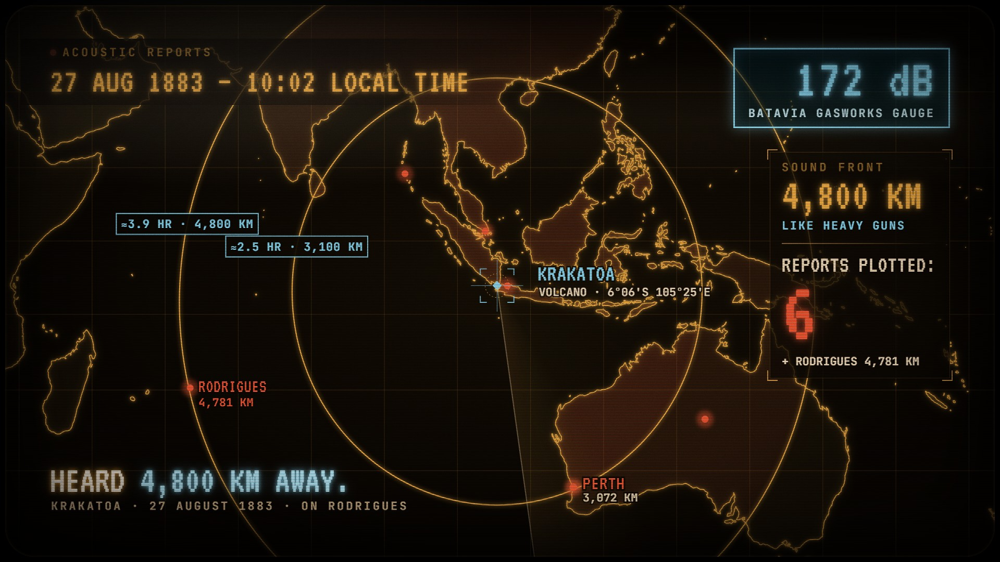

# Range Rings · `coldwar-range-rings`


A CRT display powers on, the coastline draws outward from a site, and a reticle locks on. True geodesic
range rings then grow across the map one after another. Every city flips red on the exact frame a ring
reaches it while the readout counts range and hits. The target lands with a callout, a camera punch and a
screen tear, then an alarm badge flashes and a closing line types out the stakes.

<!-- catalog:start · generated by tools/catalog.mjs from style.js; edit the style, then rerun -->
| | |
|---|---|
| **Style id** | `coldwar-range-rings` |
| **Primary niches** | Cold War history · Military & geopolitics · Nuclear history |
| **Also fits** | Volcano & disaster explainers · Explosions & shockwaves · Current-events missile ranges · Aviation & drone range · Radio & broadcast coverage · Earthquake reach |
| **Length** | 8.5 s · poster frame 8 s · 115 sound cues |
| **Palette** | `#58FF9A` `#FFB347` `#FF4545` |
| **Techniques** | True geodesic range rings · Contact-timed city hits · CRT phosphor display |

**Why it retains:** The rings are a countdown the viewer can watch: each city flips red the instant the circle touches it, the capital lands last on the very edge of the first ring, and the alarm only sounds once the whole country is inside.

**Retention beats** (the editing decisions, in order)

| t | beat |
|---:|---|
| 0.05 s | CRT power-on gives a strong first frame and sets the era |
| 1.60 s | Reticle narrows a continent down to one site |
| 2.40 s | Rings are true geodesic circles; each city flips on contact |
| 3.95 s | Washington sits on the edge of ring one, so it lands last |
| 6.20 s | The alarm sounds only once the last ring has locked |
| 6.72 s | Closing line types out the stakes in five words |

**Showcase card:** Cold War History · *Thirteen Days*  
**Facts:** Rings from the CIA October 1962 briefing map: SS-4 MRBM 1,020 nm and SS-5 IRBM 2,200 nm, centred on the San Cristóbal MRBM sites a U-2 photographed on 14 Oct 1962. City distances are great-circle distances computed from the site (Washington 1,019 nm). Crisis 16–28 Oct 1962; SAC went to DEFCON 2 on 24 Oct. Natural Earth 50m map.

**Examples**

| params | niche | title | frame |
|---|---|---|---|
| defaults | Cold War History | Thirteen Days |  |
| [`examples/krakatoa-1883.json`](examples/krakatoa-1883.json) | Volcano & disaster explainers | Heard 4,800 km Away |  |

**Render**

```bash
node tools/render.mjs sheet coldwar-range-rings
node tools/render.mjs video coldwar-range-rings --params styles/coldwar-range-rings/examples/krakatoa-1883.json
```

<details><summary>Default params (copy into a params file and change what you need)</summary>

```json
{
  "map": "cold",
  "unit": "nm",
  "site": {
    "name": "SAN CRISTÓBAL",
    "sub": "MRBM SITES · {coords}",
    "lon": -83.05,
    "lat": 22.72,
    "highlight": "cuba"
  },
  "rings": [
    { "label": "SS-4", "radius": 1020, "readout": "SS-4 · MRBM" },
    { "label": "SS-5", "radius": 2200, "readout": "SS-5 · IRBM" }
  ],
  "ringLabelBearing": 290,
  "target": "Washington",
  "cities": [
    { "name": "Miami", "lon": -80.19, "lat": 25.76, "label": "right" },
    { "name": "New Orleans", "lon": -90.07, "lat": 29.95 },
    { "name": "Houston", "lon": -95.37, "lat": 29.76 },
    { "name": "Atlanta", "lon": -84.39, "lat": 33.75 },
    { "name": "Dallas", "lon": -96.8, "lat": 32.78 },
    { "name": "Washington", "lon": -77.04, "lat": 38.9, "callout": "WASHINGTON, D.C.", "label": "left" },
    { "name": "St. Louis", "lon": -90.2, "lat": 38.63 },
    { "name": "New York", "lon": -74.01, "lat": 40.71 },
    { "name": "Chicago", "lon": -87.63, "lat": 41.88 },
    { "name": "Detroit", "lon": -83.05, "lat": 42.33 },
    { "name": "Boston", "lon": -71.06, "lat": 42.36 },
    { "name": "Denver", "lon": -104.99, "lat": 39.74 },
    { "name": "Minneapolis", "lon": -93.27, "lat": 44.98 },
    { "name": "Los Angeles", "lon": -118.24, "lat": 34.05, "label": "left" },
    { "name": "San Francisco", "lon": -122.42, "lat": 37.77, "label": "right" },
    { "name": "Seattle", "lon": -122.33, "lat": 47.61, "label": "right" },
    { "name": "Mexico City", "lon": -99.13, "lat": 19.43 }
  ],
  "header": { "label": "SITUATION DISPLAY", "text": "14 OCT 1962 — U-2 RECONNAISSANCE" },
  "readout": { "range": "RANGE", "count": "CITIES IN RANGE:" },
  "inRange": "INSIDE RANGE",
  "outOfRange": "OUT OF RANGE",
  "alert": { "text": "DEFCON 2", "sub": "SAC · 24 OCT 1962" },
  "closing": {
    "text": "THE WORLD HAD ",
    "accent": "13 DAYS.",
    "sub": "THE CRISIS RAN 16–28 OCTOBER 1962"
  },
  "framing": [
    [985, 575, 1.07],
    [1000, 585, 1],
    [1172, 772, 1.55],
    [1112, 616, 1.13],
    [1106, 606, 1.14],
    [978, 474, 0.915],
    [985, 474, 0.935]
  ],
  "graticule": {
    "lon": [-150, -30],
    "lat": [-10, 70],
    "step": 10
  },
  "droneHz": 36.7,
  "colors": {
    "phosphor": "#58FF9A",
    "pale": "#C9FFE0",
    "accent": "#FFB347",
    "hit": "#FF4545",
    "bg": "#020A05",
    "shade": "#010603",
    "panel": "#020905",
    "closing": "#EAFFF2",
    "closingAccent": "#FFC56E",
    "closingSub": "#AAFFCD",
    "alertSub": "#FFD9A8",
    "alertBg": "#281600",
    "crt": {
      "pulse": "#C8FFE1",
      "sweep": "#BEFFD7",
      "band": "#78FFB4",
      "glare": "#D2FFE6",
      "tear": "#C8FFDC",
      "powerLine": "#E6FFF0",
      "powerFlash": "#DFFFEA"
    }
  }
}
```
</details>
<!-- catalog:end -->

## Params

| key | default | what it controls · limits |
|---|---|---|
| `map` | `cold` | region key in `data/mapdata.js`. See "Adding a map region" below |
| `unit` | `nm` | `nm` · `km` · `mi`: ring radii and every distance on screen |
| `site.name` | `SAN CRISTÓBAL` | typed next to the reticle |
| `site.sub` | `MRBM SITES · {coords}` | second line. `{coords}` becomes the site's latitude and longitude in degrees and minutes |
| `site.lon`, `site.lat` | `-83.05`, `22.72` | ring centre |
| `site.highlight` | `cuba` | a country path in the region data (`countries` in maps.config), tinted with the accent on lock. `null` skips it |
| `site` | — | `null` uses the region's own `site` from maps.config |
| `rings` | SS-4 1,020 · SS-5 2,200 | 1–3 rings that grow in turn inside 2.4 → 6.05 s. Two rings keep the showcase split (2.4–4.12, 4.35–6.05). `null` uses the region's `rings` |
| `rings[].label`, `radius` | `SS-4`, `1020` | the tag on the ring reads `label · radius UNIT`. An empty label shows just the distance. The tag box widens for long text |
| `rings[].readout` | `SS-4 · MRBM` | panel line under the live range while that ring grows. Shrinks to fit |
| `ringLabelBearing` | `290` | compass bearing from the site where ring tags sit. Pick open water or empty land |
| `target` | `Washington` | city name that gets the big callout, the camera punch, the screen tear and the riser. If it's hit before 4.6 s the callout hands off to a compact tag as the camera pulls wide. Unknown or out-of-range names skip the beat |
| `cities` | 17 US and Mexican cities | 3–24 cities `{ name, lon, lat }` (more are ignored). Distance = great circle from the site, rounded to whole units; hit time = the frame the ring reaches it. `null` uses the region's `cities` |
| `cities[].label` | derived | `left` · `right`. Side for the cities that get a label. Default is away from the site horizontally |
| `cities[].callout` | `WASHINGTON, D.C.` | the target's big label (default: its name in capitals) |
| labelled cities | automatic | the first hit (skipped if it sits on the site label), the farthest hit, the target, and up to three cities the last ring never reaches |
| `header.label`, `header.text` | `SITUATION DISPLAY`, `14 OCT 1962 — U-2 RECONNAISSANCE` | mono kicker, and the typed headline (shrinks past 1000 px) |
| `readout.range`, `readout.count` | `RANGE`, `CITIES IN RANGE:` | panel labels |
| `inRange` | `INSIDE RANGE` | after the target's distance |
| `outOfRange` | `OUT OF RANGE` | after cities left outside |
| `alert.text`, `alert.sub` | `DEFCON 2`, `SAC · 24 OCT 1962` | flashing badge with buzzers at 6.2 s. `alert: null` hides it |
| `closing.text`, `accent`, `sub` | `THE WORLD HAD `, `13 DAYS.`, crisis dates | closing line typed from 6.72 s (accent in the second colour). Long lines type faster and shrink to fit |
| `framing` | 7 hand-set shots | camera `[x, y, zoom]` in map px at 0, 1.45, 2.35, 3.85, 4.3, 5.95 and 8.5 s (open, settle, site close-up, first ring, hold, last ring, end). The region's own frame is `[960, 540, 1]`. `null` frames the site and rings automatically |
| `graticule` | `{ lon: [-150, -30], lat: [-10, 70], step: 10 }` | grid lines in degrees. `null` covers the frame |
| `droneHz` | `36.7` | low drone and the closing bass note |
| `colors.phosphor` | `#58FF9A` | coastline, rings, grid, header, range readout, sweep |
| `colors.accent` | `#FFB347` | site, reticle lock, ring tags, highlight country, readout line, alert |
| `colors.hit` | `#FF4545` | cities in range, in-range tint, count, callouts |
| `colors.*` | see defaults | `pale` (wavefront, sub-lines) · `bg` (screen, text outlines) · `shade` (dark bands) · `panel` · `closing` · `closingAccent` · `closingSub` · `alertSub` · `alertBg` |
| `colors.crt.*` | green glints | `pulse` · `sweep` · `band` · `glare` · `tear` · `powerLine` · `powerFlash`. Retint these with `phosphor` for another CRT colour |
| `palette`, `meta`, `bg` | from style.js | portfolio swatches, card copy (`niche`, `title`, `why`, `facts`), page background |

## Adapting it

- **Volcano and disaster explainers:** see [`examples/krakatoa-1883.json`](examples/krakatoa-1883.json).
  It uses the `krakatoa` region, `unit: "km"`, and rings labelled with sound travel time. The cities are
  only places that reported hearing the blast, and Perth is the target on the edge of ring one. The
  palette is amber phosphor with cyan accents, and `framing`/`graticule` are `null`.
- **Current-events missile ranges:** add a region around the launch site, set `unit: "km"`, and use
  published ranges for `rings` with the system name in `readout`. Choose the capital as `target` and make
  `alert` a date or a policy line. Cite every range in `meta.facts`.
- **Aviation, drone and ferry range:** the rings are range on a full tank from a base (`unit: "nm"`), the
  cities are airports, and `target` is the one just inside. Set `outOfRange: "NEEDS A FUEL STOP"`,
  `alert: null`, and a closing line with the payoff number.
- **Radio or broadcast reach, earthquake felt reports:** rings at documented distances and cities that
  actually reported. Retint to a cool blue with `colors.phosphor`, `pale` and `colors.crt.*`.
- **Adding a map region:** add an entry to `data/maps.config.json`, for example
  `"korea": { "bounds": [[100, 0], [170, 55]], "pad": 10, "clip": 500, "borders": true }`, then run
  `node tools/mapgen.mjs`. The bounds become the 1920×1080 frame at zoom 1. Size them to hold most of the
  outer ring. Add `"countries": { "key": "ISO numeric id" }` for a `site.highlight` path. `site`, `rings`
  and `cities` can live in the config too (then set them to `null` in params), but params are enough.
  Don't change existing regions.

## Limits

- 1–3 rings, 3–24 cities. Rings share 2.4 → 6.05 s, so three rings grow quickly.
- Rings are true great circles drawn in Mercator. They must not cross a pole or the ±180° meridian, and
  near the edges of big regions they stretch vertically (correct, but it can surprise viewers).
- Every city inside a ring flips red. Only list places where "in range" is true for your story; the tint
  covers all land inside the rings.
- Automatic `framing` is a heuristic. Hand-set it for a showcase, and keep labelled cities out of the
  header band (top left) and the readout panel (right).
- Only the first hit, farthest hit, target and up to three out-of-range cities get labels. Other hits
  show in the readout's last line.
- The CRT look reads as a monitoring display. For stories before about 1950 it's a stylisation, so say
  so in the piece or keep the framing data-first.
