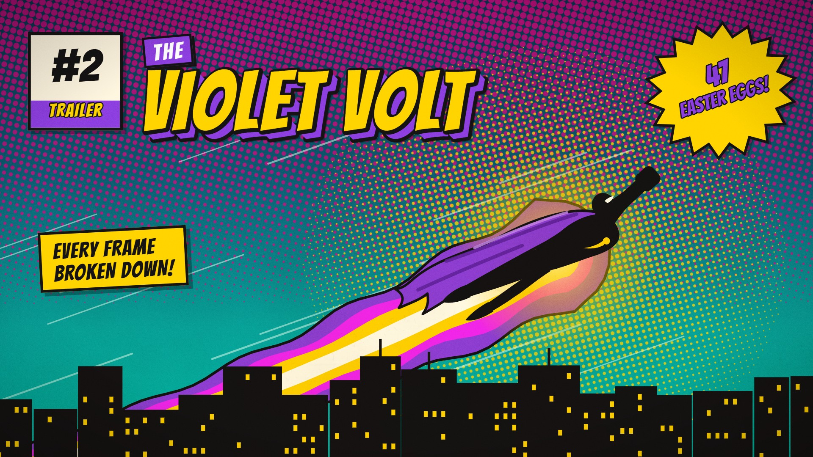

# Panel Slam · `comics-panel-slam`


A 1960s comic page builds panel by panel. A storm panel slams in with thunder and a caption, the masked eyes
snap to camera under a balloon, and a blast panel bursts with the SFX word lettered in one letter at a time.
The camera dives into the explosion until the halftone dots swallow the frame and cut to a comic cover, where
the masthead, corner box, starburst and blurb land on a chord stab. Every word and the print palette come
from params; the art and choreography stay in code.

<!-- catalog:start · generated by tools/catalog.mjs from style.js; edit the style, then rerun -->
| | |
|---|---|
| **Style id** | `comics-panel-slam` |
| **Primary niches** | Comics & pop culture · Superhero film & TV · Comic book history |
| **Also fits** | Movie trailer breakdowns · Anime & manga recaps · Video game story recaps · Webcomic & indie comic promos · Origin-story explainers · Sports hype intros · Personalized hero intros |
| **Length** | 7.0 s · poster frame 6.6 s · 32 sound cues |
| **Palette** | `#E53935` `#FFD400` `#00AEEF` |
| **Techniques** | Panel slams with impact shake · Letter-by-letter SFX lettering · Halftone dot transition |

**Why it retains:** Each panel lands on its own beat, the KRAKOOM hit pays off a riser, and the dive through the dots turns the payoff into the cover reveal.

**Retention beats** (the editing decisions, in order)

| t | beat |
|---:|---|
| 0.00 s | Panel slams in at 1.3x on frame one; thunder sells the landing |
| 0.90 s | Extreme close-up on the eyes; the line is two words |
| 1.50 s | Riser, then the KRAKOOM hit: shake, halftone flash, lettering |
| 3.20 s | Camera dives into the panel; its dots grow into the cut |
| 4.20 s | Cover lands on a bright major-chord stab: payoff and title |

**Showcase card:** Comics & Pop Culture · *Panel Slam*  
**Facts:** Fictional hero and title; the 12¢ cover price is period-correct, as US newsstand comics rose from 10¢ to 12¢ over 1961–62.

**Examples**

| params | niche | title | frame |
|---|---|---|---|
| defaults | Comics & Pop Culture | Panel Slam |  |
| [`examples/trailer-breakdown.json`](examples/trailer-breakdown.json) | Movie trailer breakdowns | The Violet Volt: Trailer #2 |  |

**Render**

```bash
node tools/render.mjs sheet comics-panel-slam
node tools/render.mjs video comics-panel-slam --params styles/comics-panel-slam/examples/trailer-breakdown.json
```

<details><summary>Default params (copy into a params file and change what you need)</summary>

```json
{
  "caption": "MIDNIGHT...",
  "balloon": { "text": "NOT TONIGHT.", "kind": "speech" },
  "sfx": "KRAKOOM!",
  "hero": "CRIMSON COMET",
  "cover": {
    "the": "THE",
    "price": "12¢",
    "issue": "ISSUE #1",
    "badge": ["FIRST", "APPEARANCE!"],
    "blurb": ["FROM THE STARS", "A HERO IS BORN!"]
  },
  "padNotes": [261.6, 329.6, 392, 523.3],
  "chordNotes": [523.3, 659.3, 784, 1046.5],
  "droneHz": 55,
  "colors": {
    "yellow": "#FFD400",
    "cyan": "#00AEEF",
    "magenta": "#EC008C",
    "hero": "#E53935",
    "ink": "#151313",
    "paper": "#FFF6E0",
    "skin": "#F8C9A4"
  }
}
```
</details>
<!-- catalog:end -->

## Params

| key | default | what it controls · limits |
|---|---|---|
| `caption` | `MIDNIGHT...` | panel 1 caption box. One line up to 560 px (about 24 characters); longer text wraps to two lines, then shrinks. `""` hides it and its pop |
| `balloon.text` | `NOT TONIGHT.` | panel 2 balloon, breaking the top border. Longer lines widen the balloon to the left and down (up to 472 × 150 px) and break onto two balanced lines before the lettering shrinks; about 30 characters read well. `""` hides it |
| `balloon.kind` | `speech` | `speech` (oval with a tail), `thought` (cloud with shrinking puffs) or `shout` (jagged burst with a spike) |
| `sfx` | `KRAKOOM!` | panel 3 lettering, one letter at a time from the hit, each with its own pop. A closing `!` or `?` is drawn a size up. Up to 8 letters keep the showcase stagger; longer words stagger tighter to land in the same 0.46 s, and the word shrinks past 1560 px (about 14 letters) |
| `hero` | `CRIMSON COMET` | the cover masthead. One line up to 1120 px; a multi-word name that would shrink under 72% stacks on two balanced lines |
| `cover.the` | `THE` | tilted box above the masthead; shrinks past 560 px. `""` hides it (the masthead stays where it is) |
| `cover.price` | `12¢` | corner box, big; shrinks past 184 px (about 4 characters) |
| `cover.issue` | `ISSUE #1` | corner box band; shrinks past 188 px (about 10 characters). With `price` also empty, the corner box is hidden |
| `cover.badge` | `["FIRST", "APPEARANCE!"]` | starburst lines: line 1 at 72 px, line 2 at 47 px, each shrinking past 262 px (about 7 and 11 characters). `[]` hides the burst and its sound |
| `cover.blurb` | `["FROM THE STARS", "A HERO IS BORN!"]` | yellow caption box, 1–3 lines; shrinks when the widest line passes 636 px (about 22 characters). `[]` hides it |
| `padNotes` | `[261.6, 329.6, 392, 523.3]` | pad under the cover (Hz). The default is C major |
| `chordNotes` | `[523.3, 659.3, 784, 1046.5]` | the stab when the cover lands (Hz) |
| `droneHz` | `55` | the page's low drone up to the cut (Hz) |
| `colors.yellow` | `#FFD400` | caption and blurb boxes, lettering fill, lit windows, lightning, blast, masthead face, starburst |
| `colors.cyan` | `#00AEEF` | irises, the dot transition and the cover sky (the sky's darker blues follow it) |
| `colors.magenta` | `#EC008C` | the halftone plates on the night sky, the skin and the cover |
| `colors.hero` | `#E53935` | the hero's colour: mask, cape, comet trail, 3D extrusions, THE box, issue band, blast ring, badge lettering (their darker and lighter shades follow it) |
| `colors.ink` | `#151313` | the black plate: outlines, skylines, pupils, lettering edges |
| `colors.paper` | `#FFF6E0` | the page, its paper texture and the corner box |
| `colors.skin` | `#F8C9A4` | the hero's skin in the eyes panel (under the magenta Ben-Day screen) |
| `palette`, `meta`, `bg` | from style.js | portfolio swatches, card copy (`niche`, `title`, `why`, `facts`), page background |

## Adapting it

- **Movie trailer breakdowns** (the example): `caption: "THIS SUMMER..."`, a line from the trailer in the
  balloon, `sfx: "BRAAAM!"`, the film's title as `hero`, the corner box as `#2` over `TRAILER`, the badge as the
  video's hook (`["47", "EASTER EGGS!"]`) and the blurb as its promise. A teal `cyan` and a violet `hero` give a
  poster-grade look. Use fictional films, or ones you have the rights to show.
- **Anime & manga recaps**: `caption: "PREVIOUSLY..."`, `balloon.kind: "thought"` for the inner monologue, a
  transliterated SFX such as `DOKAAN!`, `cover.price: "EP.12"`, `cover.issue: "RECAP"` and
  `cover.badge: ["SEASON", "FINALE!"]`.
- **Video game story recaps**: `caption: "CHAPTER 7..."`, `sfx: "KA-CHUNK!"`, `cover.issue: "ACT III"`,
  `cover.badge: ["BOSS", "FIGHT!"]`, and `colors.hero` in the protagonist's colour.
- **Sports hype intros**: the player as a persona (`hero: "CLUTCH KID"`), `caption: "0:03 LEFT..."`,
  `balloon.kind: "shout"`, `sfx: "SWISH!"`, `cover.price: "#23"`, `cover.issue: "GAME 7"` and the team colour
  as `colors.hero`. The art stays a caped hero, so pitch it as a playful persona.
- **Personalized hero intros**: the person's name as `hero`, `cover.badge: ["BIRTHDAY", "SPECIAL!"]`, and
  `colors.skin` and `colors.hero` to match them.

## Limits

- The art is fixed: a night-storm city, a face in a domino mask, a blast and a caped hero flying over a
  skyline. Another figure, an unmasked face or a daytime scene needs code.
- Only the words, the print palette and the skin tone change. Keep the SFX to one onomatopoeia (14 letters at
  most) and the balloon to about 30 characters; past that the lettering drops below comfortable reading size.
- The default `12¢` is period flavour (see Facts). If you print a real price, date or statistic anywhere on
  the cover, update `meta.facts` to match.
- Fictional heroes and titles only: the cover imitates the 1960s format, not any publisher's trade dress.
- `duration` is fixed at 7 s; the cut to the cover is at 4.2 s.
