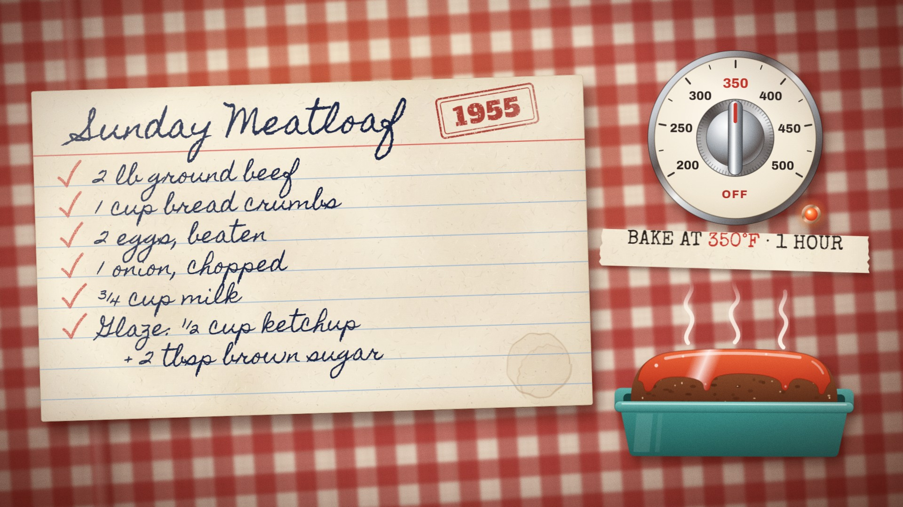
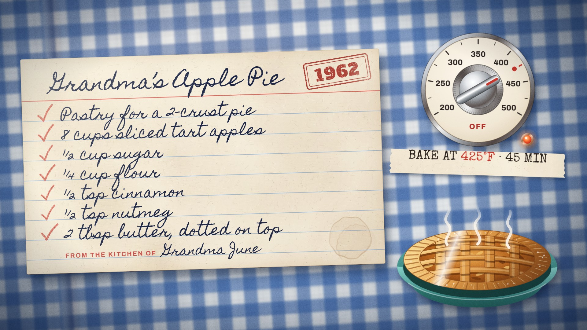

# Recipe Card · `cooking-recipe-card`



An index card slides onto a gingham tablecloth, its title writes itself at pen speed and a year stamp slams down
beside it. Each ingredient is handwritten on a steady beat and ticked in red pencil while the camera holds tight
on the card. The camera then pulls out to a chrome oven dial that clicks through its detents to the bake
temperature, a kitchen timer winds and sweeps the bake time in half a second, and the ding swaps it for the
finished dish, steaming.

<!-- catalog:start · generated by tools/catalog.mjs from style.js; edit the style, then rerun -->
| | |
|---|---|
| **Style id** | `cooking-recipe-card` |
| **Primary niches** | Cooking · Family recipes · Retro & vintage food |
| **Also fits** | Baking · Food history · Heirloom & grandma recipes · Comfort food · Budget home cooking · Holiday baking |
| **Length** | 7.5 s · poster frame 7.1 s · 70 sound cues |
| **Palette** | `#C8322B` `#F6EEDC` `#2E7C79` |
| **Techniques** | Soft-edge handwriting reveal · Detent-stepped dial with synced clicks · Time-lapse timer into payoff swap |

**Why it retains:** A steady write-and-tick beat pulls the eye down the card, then three tactile payoffs (click, sweep, ding) turn a list into a finished dish.

**Retention beats** (the editing decisions, in order)

| t | beat |
|---:|---|
| 0.00 s | Card slides in tight: prop, era and topic land in the first frame |
| 0.62 s | Title writes at pen speed so the eye reads along |
| 1.20 s | Each ingredient is written, then ticked, on a steady 0.44 s beat |
| 3.98 s | Camera pulls out as the list completes, revealing the oven |
| 4.56 s | Dial snaps through detents, one click per 25 degrees |
| 5.58 s | An hour sweeps by in half a second; the ding delivers the dish |

**Showcase card:** Cooking · *Sunday Meatloaf, 1955*  
**Facts:** Amounts, the ketchup and brown-sugar glaze and 350°F for about an hour follow standard mid-century American recipes for a 2 lb meatloaf; the card itself is fictional.

**Examples**

| params | niche | title | frame |
|---|---|---|---|
| defaults | Cooking | Sunday Meatloaf, 1955 |  |
| [`examples/grandmas-apple-pie.json`](examples/grandmas-apple-pie.json) | Baking | Grandma’s Apple Pie, 1962 |  |

**Render**

```bash
node tools/render.mjs sheet cooking-recipe-card
node tools/render.mjs video cooking-recipe-card --params styles/cooking-recipe-card/examples/grandmas-apple-pie.json
```

<details><summary>Default params (copy into a params file and change what you need)</summary>

```json
{
  "title": "Sunday Meatloaf",
  "year": "1955",
  "kitchen": "",
  "kitchenLabel": "FROM THE KITCHEN OF",
  "ingredients": [
    { "amount": "2 lb", "item": "ground beef" },
    { "amount": "1 cup", "item": "bread crumbs" },
    { "amount": "2", "item": "eggs, beaten" },
    { "amount": "1", "item": "onion, chopped" },
    { "amount": "¾ cup", "item": "milk" },
    { "prefix": "Glaze:", "amount": "½ cup", "item": "ketchup", "more": "+ 2 tbsp brown sugar" }
  ],
  "method": "BAKE AT {temp} · {time}",
  "oven": { "temp": 350, "unit": "F" },
  "timer": 60,
  "dish": "meatloaf",
  "ding": "DING!",
  "padNotes": [174.6, 220, 261.6, 329.6],
  "colors": {
    "ink": "#1E2747",
    "pencil": "#C4382D",
    "stamp": "#AE2F29",
    "red": "#C7372C",
    "card": "#F6EEDC"
  },
  "cloth": {
    "base": "#F0E2CF",
    "check": "#A81E1A",
    "weave": "#5A1E12",
    "shade": "#5C1E0E",
    "vignette": "#280802",
    "shadow": "#2E0A02",
    "cardShadow": "#320A02"
  }
}
```
</details>
<!-- catalog:end -->

## Params

| key | default | what it controls · limits |
|---|---|---|
| `title` | `Sunday Meatloaf` | handwritten title, 72 px. Shrinks so the stamp always fits: about 16 characters stay full size beside a stamp, about 22 without |
| `year` | `1955` | the rubber stamp beside the title. `""` hides it (and its thud) |
| `kitchen` | `""` | a name signed after the printed `kitchenLabel` on the card's last ruled line, written after the list. Setting it limits the list to 7 rows |
| `kitchenLabel` | `FROM THE KITCHEN OF` | the pre-printed form label (red caps) |
| `ingredients` | 6 items on 7 rows | each `{ amount, item }` is one handwritten row, ticked when it's written. Optional `prefix` (e.g. `Glaze:`) is written first; optional `more` adds an indented row under the same tick. A plain string works too. Supported: 3–8 rows (7 with a kitchen line); items past that are dropped. Rows longer than about 36 characters shrink to fit |
| `method` | `BAKE AT {temp} · {time}` | the typed strip under the dial: a string, or an array of up to 2 lines. `{temp}` becomes the red temperature, `{time}` the bake time (`1 HOUR`, `45 MIN`, `1 HR 30 MIN`). Shrinks past 520 px |
| `oven.temp`, `oven.unit` | `350`, `F` | the dial setting. `F` dial: 200–500 in 25° detents, labels every 50. `C` dial: 100–240 in 10° detents, labels every 20. The knob angle and the number of detent clicks are computed; off-grid values snap to the nearest detent and out-of-range values clamp. A setting without a label (e.g. 425 °F) gets a red marker dot |
| `oven.min`, `oven.max`, `oven.step`, `oven.major` | from the unit | override the dial scale, e.g. `{ "unit": "C", "min": 50, "max": 250, "step": 10, "major": 50 }` |
| `timer` | `60` | bake time in minutes. The 60-minute timer winds to it (capped at 60) and sweeps back to zero; its ratchet clicks scale with it; `{time}` prints the full value |
| `dish` | `meatloaf` | the payoff drawing: `meatloaf` (glazed loaf in a teal loaf pan) or `pie` (lattice apple pie in a teal pie plate) |
| `ding` | `DING!` | the burst's caption. Shrinks past 190 px; `""` hides the burst (the bell still rings) |
| `padNotes` | F major 7 | the pad under the piece (Hz) |
| `colors.ink` | `#1E2747` | handwriting |
| `colors.pencil` | `#C4382D` | the ticks |
| `colors.stamp` | `#AE2F29` | the year stamp |
| `colors.red` | `#C7372C` | dial pointer and set number, `{temp}`, timer flag, DING |
| `colors.card` | `#F6EEDC` | the index card's paper |
| `cloth.base`, `cloth.check` | `#F0E2CF`, `#A81E1A` | gingham ground and check colour |
| `cloth.weave` | `#5A1E12` | thread texture multiplied into the cloth |
| `cloth.shade`, `cloth.vignette` | `#5C1E0E`, `#280802` | edge falloff and vignette; use a dark version of the check colour |
| `cloth.shadow`, `cloth.cardShadow` | `#2E0A02`, `#320A02` | drop shadows of the props and of the card |
| `palette`, `meta`, `bg` | from style.js | portfolio swatches, card copy (`niche`, `title`, `why`, `facts`), page background |

## Adapting it

- **Baking** (see `examples/grandmas-apple-pie.json`): `dish: "pie"`, `oven: { "temp": 425 }`, `timer: 45`, a
  `kitchen` name, and blue `cloth` with cool shadows (`shade`, `vignette`, `shadow`, `cardShadow` all dark navy).
- **Food history**: keep the red gingham, set `year` to the recipe's era, copy a period cookbook's amounts and
  oven temperature, and cite it in `meta.facts`. `prefix` handles sections (`Sauce:`, `Topping:`).
- **Metric and European recipes**: `oven: { "temp": 180, "unit": "C" }`, metric amounts, and the method in your
  language, using `{temp}` and your own time words (`BACKEN BEI {temp} · 50 MINUTEN`).
- **Comfort food and holiday baking**: change the title, `padNotes` (a warmer major 7th or a festive triad) and
  the cloth (green or yellow gingham); the payoff stays a loaf or a pie.

## Limits

- Two dishes are drawn in code: a meatloaf and a lattice pie. Any other payoff (cake, roast, casserole) needs a
  new entry in `DISHES` in style.js.
- The timer face is 60 minutes; longer bakes wind a full turn while the strip prints the real time.
- 3–8 ingredient rows (7 with a kitchen line). The beat is 0.44 s for the showcase's 6 items, slows to 0.55 s for
  short lists and speeds up to 0.31 s for 8. Fewer than 3 rows leaves the card bare for a long stretch.
- The handwriting face (Homemade Apple) covers Latin script and the ¼ ½ ¾ fractions; write other fractions as
  `1/8`. Very long titles and rows stay on the card by shrinking, so keep them short for impact.
- Duration is fixed at 7.5 s: the oven, timer and payoff beats keep their showcase times whatever the list length.
