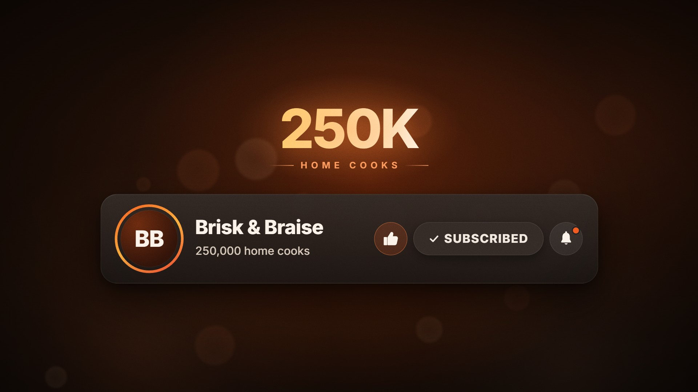

# Subscribe Card · `cta-subscribe`


A channel card rises and a cursor glides in on a curve, hovers the button and clicks it. The button morphs
into its done state while the row reflows and the bell slides in. The count rolls over on an odometer, the
milestone badge lands with confetti, the bell rings, and the cursor pays off the like before the card rests
as an end card. Every icon is drawn in code, with no platform logos or wordmarks, and the style also renders
as a transparent overlay (`--alpha`).

<!-- catalog:start · generated by tools/catalog.mjs from style.js; edit the style, then rerun -->
| | |
|---|---|
| **Style id** | `cta-subscribe` |
| **Primary niches** | Universal CTA · Channel end screens · Creator branding |
| **Also fits** | Cooking channels · Gaming channels · Tech reviews · Podcasts (follow) · Newsletters · Music artists (follow) · Fitness coaches · Education channels |
| **Length** | 5.5 s · poster frame 4.8 s · 25 sound cues |
| **Palette** | `#FF0033` `#F4F1EE` `#1A171B` |
| **Techniques** | Cursor-led UI choreography · Odometer roll-over · Micro-interaction payoffs |

**Why it retains:** A moving cursor gives the eye a path to follow, and each click pays off with a new reaction (morph, count, confetti, bell, like), so the ask feels like an event rather than a request.

**Retention beats** (the editing decisions, in order)

| t | beat |
|---:|---|
| 0.02 s | Card and CTA are on screen in the first half-second |
| 0.55 s | Cursor arrives on a curve, leading the eye to the button |
| 1.58 s | Click lands with a press, a ripple and an instant state change |
| 1.98 s | Odometer rolls over to 100,000; confetti rewards the action |
| 2.78 s | Bell rings on its own to show what the viewer gets |
| 3.52 s | Like pays off last, then the frame rests as the end card |

**Showcase card:** Universal CTA · *Subscribe & Bell*  
**Facts:** Generic UI with no platform branding; the channel name and subscriber counts are placeholders.

**Examples**

| params | niche | title | frame |
|---|---|---|---|
| defaults | Universal CTA | Subscribe & Bell |  |
| [`examples/cooking-channel.json`](examples/cooking-channel.json) | Cooking channels | Join the Table |  |

**Render**

```bash
node tools/render.mjs sheet cta-subscribe
node tools/render.mjs video cta-subscribe --params styles/cta-subscribe/examples/cooking-channel.json
```

<details><summary>Default params (copy into a params file and change what you need)</summary>

```json
{
  "channel": "Your Channel",
  "initials": "YC",
  "countFrom": 99999,
  "countTo": 100000,
  "countLabel": "subscribers",
  "button": "SUBSCRIBE",
  "buttonDone": "SUBSCRIBED",
  "badge": "{short}",
  "badgeLabel": "SUBSCRIBERS",
  "show": { "like": true, "bell": true, "confetti": true },
  "padNotes": [196, 246.9, 293.7, 392],
  "endChord": [392, 493.9, 587.3, 784],
  "endPing": 2093,
  "background": "radial-gradient(110% 95% at 50% 36%, #2b0b14 0%, #19090e 40%, #0c0a0c 100%)",
  "colors": {
    "accent": "#FF0033",
    "buttonInk": "#FFFFFF",
    "hover": "#FF2A57",
    "hoverGlow": "#FF1446",
    "soft": "#FF6B85",
    "light": "#FF8FA3",
    "likeEdge": "#FF3C64",
    "ink": "#F4F1EE",
    "count": "#A9A2A7",
    "countAfter": "#C9C2C7",
    "done": "#2D2B32",
    "doneInk": "#ECE9EC",
    "gold": "#FFD08A",
    "badge": ["#FFE9C9", "#FFFFFF", "#FF9C70"],
    "badgeLabel": "#FF7890",
    "badgeGlow": "#FF785A",
    "badgeShadow": "#FF6E50",
    "ring": ["#FF0033", "#FF7A3D", "#FF2E88"],
    "avatar": ["#5A1424", "#2A0C14", "#1A0A0F"],
    "card": ["#2E2A31", "#19171C"],
    "lights": ["#BE0E30", "#FF465A", "#78143C", "#FF966E"],
    "bokeh": ["#FF5A6E", "#FFC4A0"],
    "confetti": ["#FF0033", "#FF4D6D", "#FFD08A", "#FFFFFF", "#FF8FA3", "#FFB36B"]
  }
}
```
</details>
<!-- catalog:end -->

## Params

| key | default | what it controls · limits |
|---|---|---|
| `channel` | `Your Channel` | name on the card. About 15 characters fit at full size (440 px with the default buttons); longer names shrink to fit, and past ~26 characters they drop below 30 px |
| `initials` | `YC` | avatar monogram, 1–3 characters (extra characters are cut; three wide letters shrink to fit the disc) |
| `countFrom`, `countTo` | `99999`, `100000` | the odometer rolls `countFrom` → `countTo`. Carries ripple right to left, each digit rolls forward through the digits in between, and new leading digits (and commas) grow in. `countTo` below `countFrom` is clamped (it only counts up) |
| `countLabel` | `subscribers` | word after the number on the card (`followers`, `readers`, `home cooks`). Number plus label shrink together past 440 px |
| `button`, `buttonDone` | `SUBSCRIBE`, `SUBSCRIBED` | the button before and after the click (`FOLLOW` → `FOLLOWING`). The pill is sized to the label; labels past ~15 characters shrink |
| `badge` | `{short}` | the milestone number. `{short}` = `countTo` abbreviated (100K, 1.5M), `{count}` = `countTo` in full (100,000), `{from}` = `countFrom`. About 10 characters fit at 144 px; longer text shrinks |
| `badgeLabel` | `SUBSCRIBERS` | spaced caps under the badge. Up to ~22 characters, then shrinks |
| `show.like` | `true` | like button, the cursor's second click and the like burst. Off: the cursor leaves at 3.1 s and the card rests longer |
| `show.bell` | `true` | bell button, its ring and the notification dot. Off: the done pill sits at the right edge |
| `show.confetti` | `true` | the confetti burst behind the badge (the badge, shock ring and its sounds stay) |
| `padNotes` | `[196, 246.9, 293.7, 392]` | pad chord under the piece (Hz) |
| `endChord`, `endPing` | `[392, 493.9, 587.3, 784]`, `2093` | the soft chord and high ping as the card settles (Hz). Keep them in the pad's key |
| `background` | red radial gradient | CSS background of the stage (skipped in `--alpha` renders) |
| `colors.accent` | `#FF0033` | button fill, notification dot, liked-button tint, first like-burst streak |
| `colors.buttonInk` | `#FFFFFF` | label on the button before the click (use a dark ink on light accents) |
| `colors.hover`, `colors.hoverGlow` | `#FF2A57`, `#FF1446` | button fill and glow while the cursor hovers |
| `colors.done`, `colors.doneInk` | `#2D2B32`, `#ECE9EC` | button after the click, and its label and check |
| `colors.soft`, `colors.light` | `#FF6B85`, `#FF8FA3` | badge hairlines and like-burst streaks; like-burst dots |
| `colors.likeEdge` | `#FF3C64` | outline of the liked button |
| `colors.ink` | `#F4F1EE` | channel name, initials, icons |
| `colors.count`, `colors.countAfter` | `#A9A2A7`, `#C9C2C7` | count line before and after the roll-over (it flashes white in between) |
| `colors.gold` | `#FFD08A` | badge base colour, shock ring, like-burst streak and dot |
| `colors.badge` | `["#FFE9C9", "#FFFFFF", "#FF9C70"]` | badge sheen: light band, highlight, warm tail |
| `colors.badgeLabel`, `colors.badgeGlow`, `colors.badgeShadow` | `#FF7890`, `#FF785A`, `#FF6E50` | badge caption, the glow behind it, its drop shadow |
| `colors.ring`, `colors.avatar` | 3 stops each | avatar ring gradient; avatar disc gradient (light to dark) |
| `colors.card` | `["#2E2A31", "#19171C"]` | card gradient, top to bottom. Keep it dark (see Limits) |
| `colors.lights`, `colors.bokeh` | 4 and 2 colours | the four soft background lights; the defocused bokeh discs (not drawn in `--alpha` renders) |
| `colors.confetti` | 6 colours | confetti pieces cycle through this list (any length) |
| `palette`, `meta`, `bg` | from style.js | portfolio swatches, card copy (`niche`, `title`, `why`, `facts`), page background |

## Adapting it

- **Cooking channel** ([`examples/cooking-channel.json`](examples/cooking-channel.json)): ember-orange
  accent, warm charcoal card, `countLabel: "home cooks"` with a matching `badgeLabel`, 249,999 → 250,000 (the
  leading 2 stays put while the carry rolls), confetti in ingredient colours (tomato, saffron, basil, cream),
  and the pad moved to F major.
- **Gaming or streaming:** `button: "FOLLOW"`, `buttonDone: "FOLLOWING"`, `countLabel: "followers"`, a neon
  `accent` (for example `#7C4DFF`) with matching `hover`, `soft` and `ring`, a near-black `background`, and
  `confetti` in neon cyan, magenta and lime. Set `show.bell: false` if the platform has no bell.
- **Podcast or music artist:** `button: "FOLLOW"`, `countLabel: "listeners"`, `badge: "{short}"`,
  `badgeLabel: "LISTENERS"`, `show.like: false` (the cursor then leaves early and the card holds as an end card),
  and a calmer `padNotes` chord.
- **Newsletter or course:** `button: "SUBSCRIBE"`, `countLabel: "readers"`, `countFrom: 9999`, `countTo: 10000`,
  `badge: "{count}"` for the full 10,000, `show.like: false`, and a light accent with `buttonInk` set dark
  (for example `accent: "#FFD84D"`, `buttonInk: "#1A1600"`).

## Limits

- The card is a dark UI: the round buttons, the dot's rim and the cursor assume a dark card. A light card needs
  a code change.
- It only counts up. Start `countFrom` just below the milestone: a big jump (0 → 100,000) grows columns in
  instead of rolling, which reads less like an odometer.
- Timing is fixed at 5.5 s. Switching off the like or bell removes their beats and sounds but doesn't shorten
  the piece.
- No avatar images: params are JSON only, so the avatar is initials on a gradient.
- Everything is platform-neutral by design. Don't add real platform logos, wordmarks or button styling.
