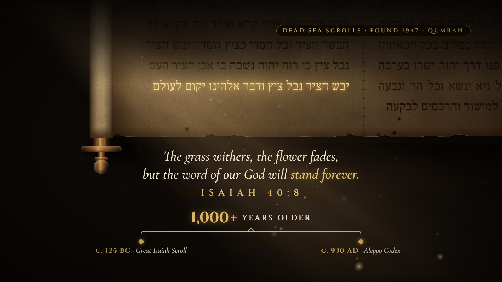
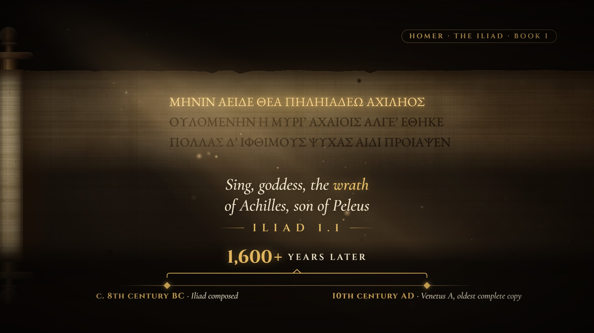

# Scroll Reveal · `faith-scroll-reveal`



A scroll unrolls from the centre between turning wooden rollers, under a candle-warm beam full of dust. The
text inks in along its own reading direction while the camera closes on one line, and a light sweep gilds that
line as the rest of the sheet dims. The translation arrives word by word with its key phrase in gold, then a
bracket draws between two dated nodes and a counter turns the gap between them into years.

<!-- catalog:start · generated by tools/catalog.mjs from style.js; edit the style, then rerun -->
| | |
|---|---|
| **Style id** | `faith-scroll-reveal` |
| **Primary niches** | Faith & Bible history · Biblical archaeology · Ancient history |
| **Also fits** | Classics & ancient literature · Jewish history & Torah · Church history & Latin texts · Mythology & epic poetry · Manuscript & book history · Historical documents & charters · Ancient philosophy quotes |
| **Length** | 8.0 s · poster frame 7.6 s · 54 sound cues |
| **Palette** | `#E2B65C` `#E8D5AE` `#1A120B` |
| **Techniques** | Unroll on turning wooden rollers · Right-to-left ink and gold sweep · Count-up timeline bracket |

**Why it retains:** The unroll is a reveal the viewer waits for, the gold sweep points at the one line that matters, and the count turns a date into a gap you can feel.

**Retention beats** (the editing decisions, in order)

| t | beat |
|---:|---|
| 0.00 s | Light and dust in frame one: atmosphere before information |
| 0.50 s | Unroll from the centre: the reveal itself is the hook |
| 2.20 s | Text inks in while the camera closes on one line |
| 3.40 s | Gold sweep runs right-to-left, in reading order |
| 4.45 s | Translation arrives word by word, at reading pace |
| 6.00 s | Timeline turns the age into a gap the viewer can feel |

**Showcase card:** Faith & Ancient History · *The Isaiah Scroll*  
**Facts:** Great Isaiah Scroll (1QIsaᵃ): found 1947 in Qumran Cave 1, dated c. 125 BC; Aleppo Codex c. 930 AD, so over 1,000 years older (about 1,054 years). Hebrew shown is the consonantal Masoretic text of Isaiah 40:1–8, not a transcription of the scroll’s own spelling; English of 40:8 as in the ESV.

**Examples**

| params | niche | title | frame |
|---|---|---|---|
| defaults | Faith & Ancient History | The Isaiah Scroll |  |
| [`examples/iliad-opening-line.json`](examples/iliad-opening-line.json) | Classics & Ancient Literature | Sing, Goddess |  |

**Render**

```bash
node tools/render.mjs sheet faith-scroll-reveal
node tools/render.mjs video faith-scroll-reveal --params styles/faith-scroll-reveal/examples/iliad-opening-line.json
```

<details><summary>Default params (copy into a params file and change what you need)</summary>

```json
{
  "chip": "DEAD SEA SCROLLS · FOUND 1947 · QUMRAN",
  "dir": "rtl",
  "font": "Frank Ruhl Libre, serif",
  "flow": true,
  "columns": 2,
  "split": 4,
  "gild": 7,
  "lines": ["נחמו נחמו עמי יאמר אלהיכם", "דברו על לב ירושלם וקראו אליה כי מלאה צבאה כי נרצה עונה כי לקחה מיד יהוה כפלים בכל חטאתיה", "קול קורא במדבר פנו דרך יהוה ישרו בערבה מסלה לאלהינו", "כל גיא ינשא וכל הר וגבעה ישפלו והיה העקב למישור והרכסים לבקעה", "ונגלה כבוד יהוה וראו כל בשר יחדו כי פי יהוה דבר", "קול אמר קרא ואמר מה אקרא כל הבשר חציר וכל חסדו כציץ השדה", "יבש חציר נבל ציץ כי רוח יהוה נשבה בו אכן חציר העם", "יבש חציר נבל ציץ ודבר אלהינו יקום לעולם"],
  "translation": ["The grass withers, the flower fades,", "but the word of our God will *stand forever.*"],
  "reference": "ISAIAH 40:8",
  "timeline": {
    "from": { "year": -125, "date": "c. 125 BC", "label": "Great Isaiah Scroll" },
    "to": { "year": 930, "date": "c. 930 AD", "label": "Aleppo Codex" },
    "roundTo": 1000,
    "unit": "YEARS OLDER"
  },
  "material": "parchment",
  "padNotes": [146.83, 220, 329.63, 369.99],
  "droneNote": 73.42,
  "pingNote": 587.3,
  "colors": {
    "gold": "#E2B65C",
    "cream": "#EFE3C8",
    "gilt": "#F3D08A",
    "ink": "#2A170A",
    "inkAlt": "#40281A",
    "parchment": "#AA8656",
    "parchmentLight": "#ECD0A2",
    "bg": "#0D0906"
  }
}
```
</details>
<!-- catalog:end -->

## Params

| key | default | what it controls · limits |
|---|---|---|
| `chip` | `DEAD SEA SCROLLS · FOUND 1947 · QUMRAN` | gold pill, top right. Shrinks past 1300 px; `""` hides it |
| `dir` | `rtl` | reading direction of `lines`: `rtl` or `ltr`. The ink reveal, the gold sweep, the glints and the column order all follow it |
| `font` | `Frank Ruhl Libre, serif` | CSS family list for the scroll text. The engine loads Hebrew (Frank Ruhl Libre), Greek (EB Garamond: `'EB Garamond', serif`) and Latin faces (also Cormorant Garamond, Cinzel). Other scripts need a system font in the list |
| `flow` | `true` | `true`: lines run on as justified text, the way the scroll is written. `false`: one line per row (verse), set as a block centred in its column |
| `columns` | `2` | `2` (two 630 px columns) or `1` (one 1350 px column, for long verse lines) |
| `split` | `4` | with 2 columns: how many `lines` fill the first column in reading order (the right-hand one for `rtl`) |
| `lines` | Isaiah 40:1–8, 8 lines | the text in reading order. Auto-fit: the font shrinks from 40 px (22 px minimum) until every column fits (6 rows at 40 px, 11 at 22 px). At 22 px an over-long verse line wraps and rows past the last one are dropped |
| `gild` | `7` | index of the gilded line (`0` = first, `-1` = last). It always gets its own row and the camera ends with it 200 px above centre. When it sits high on the scroll, the rows under the translation fade out and the lower scroll drops into shade |
| `translation` | 2 rows | rows under the gilded line, revealed word by word; `*words*` are gold (punctuation after the closing `*` stays cream). 1–2 rows read best at 44 px; 3 rows shrink to fit; any row shrinks past 1320 px. Longer texts compress the word rhythm into the showcase's 1.3 s |
| `reference` | `ISAIAH 40:8` | citation under the translation. Shrinks past 900 px; `""` hides it |
| `timeline.from`, `timeline.to` | `c. 125 BC · Great Isaiah Scroll`, `c. 930 AD · Aleppo Codex` | the two nodes, each `{ year, date, label }`. `date` and `label` are shown as `date · label` (shrinks past 760 px); `year` (negative = BC) feeds the count |
| `timeline.roundTo` | `1000` | the count shows the gap (there is no year 0) rounded down to a multiple of this, plus `+` when it was more: 1,054 becomes `1,000+`. `1` shows the exact gap |
| `timeline.unit` | `YEARS OLDER` | words after the count (`YEARS LATER`, `YEARS APART`). The row scales down past 1500 px |
| `material` | `parchment` | `parchment`: ruled lines, column margins, a stitched seam in the gutter. `papyrus`: horizontal fibre strips, faint cross fibres, glued sheet joins, no ruling |
| `padNotes`, `droneNote`, `pingNote` | D add9 pad, D2 drone, D5 ping | the bed under the piece and the ping on the gold sweep (Hz). Keep all three in one key |
| `colors.gold` | `#E2B65C` | chip, gold words, citation, bracket, counter, halo |
| `colors.gilt` | `#F3D08A` | the gilded line itself |
| `colors.cream` | `#EFE3C8` | translation, node labels, count unit |
| `colors.ink`, `colors.inkAlt` | `#2A170A`, `#40281A` | the two ink tones the words alternate between |
| `colors.parchment`, `colors.parchmentLight` | `#AA8656`, `#ECD0A2` | dark and light ends of the sheet's mottled tone (also used for papyrus) |
| `colors.bg` | `#0D0906` | the dark room behind the scroll, and every shade that fades into it |
| `palette`, `meta`, `bg` | from style.js | portfolio swatches, card copy (`niche`, `title`, `why`, `facts`), page background |

## Adapting it

- **Classics and ancient literature** (see `examples/iliad-opening-line.json`): `dir: "ltr"`, `flow: false`,
  `columns: 1`, `material: "papyrus"`, a Greek-capable `font`, `gild: 0` for a famous opening line, and a timeline
  from composition to the oldest surviving copy with a coarse `roundTo` for approximate dates.
- **Torah and Jewish history**: keep `dir`, `font` and `material`. Swap `lines` (unpointed Hebrew looks most like
  a scroll), `split`, `gild`, `translation` and `reference`, and date the scroll against a later codex.
- **Church history and Latin texts**: `dir: "ltr"`, `font: "Cormorant Garamond, serif"`, `flow: true`, a Vulgate
  or hymn text, and a timeline from composition to a famous manuscript or first printing.
- **Historical documents and charters**: `columns: 1` with `flow: true` for continuous legal prose on
  `parchment`; gild the one clause people quote, and set `roundTo: 1` when both dates are exact.

## Limits

- The engine loads web fonts for Hebrew (Frank Ruhl Libre), Greek (EB Garamond) and Latin. Any other script
  renders with a system font from `font`. The layout is measured with the same list, so it fits on the render
  machine, but another OS may pick a different fallback. To make a new script portable, add a Google Font to
  `FONTS_URL` and `FONT_FACES` in engine/engine.js.
- Capacity: about 11 run-on rows or 11 verse lines per column at the 22 px minimum. Past that, trailing rows are
  dropped, never the gilded one. The gilded line must fit one row; if it can't at 22 px, it alone gets a smaller
  size.
- The timeline nodes sit at fixed positions: it shows a gap, not a scale. Pick `roundTo` so approximate dates
  don't read as precise, and update `meta.facts` with the sources of both dates.
- The camera always ends on the gilded line. A gilded line near the top of a long text puts the translation on
  the shaded scroll rather than below it (it still reads, but the scroll's lower half goes dark).
- Duration is fixed at 8 s; the ink, sweep, translation and timeline beats keep their showcase times.
