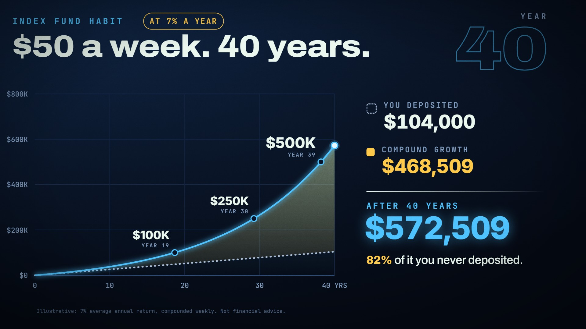

# Growth Curve · `finance-growth-curve`


A savings curve draws itself with a live value tag riding its head. Milestones pop in on a rising pitch
ladder. The gap between what you paid in and what the money is worth fills gold, and the total slams in
with a line that reframes it. Every number on screen comes from the params: future value of periodic
deposits plus an optional lump sum.

<!-- catalog:start · generated by tools/catalog.mjs from style.js; edit the style, then rerun -->
| | |
|---|---|
| **Style id** | `finance-growth-curve` |
| **Primary niches** | Personal finance · Investing · Retirement planning |
| **Also fits** | Crypto (DCA) · Real estate · Business revenue growth · Creator income · Savings challenges · Any "this compounds over time" story |
| **Length** | 8.0 s · poster frame 7.6 s · 48 sound cues |
| **Palette** | `#3DF28B` `#FFC94A` `#0B2016` |
| **Techniques** | Data-driven line reveal · Counter that rides the curve · Colour-linked payoff |

**Why it retains:** The eye tracks one moving dot while the number under it climbs, and the payoff lands twice: once on the chart and once as a slammed total.

**Retention beats** (the editing decisions, in order)

| t | beat |
|---:|---|
| 0.30 s | Hook states the promise in five words |
| 1.30 s | Line draws in real time; the tag reads the value under the dot |
| 2.70 s | Milestones pop on a rising pitch ladder |
| 5.60 s | Colour link: the gold area is the gold number |
| 6.40 s | Payoff number lands with impact and a cash-register hit |
| 7.00 s | Reframe the number so it sticks |

**Showcase card:** Personal Finance · *The Compound Curve*  
**Facts:** Future value of $500 deposited monthly at a 10% annual return, compounded monthly, 360 deposits.

**Examples**

| params | niche | title | frame |
|---|---|---|---|
| defaults | Personal Finance | The Compound Curve |  |
| [`examples/index-fund-weekly.json`](examples/index-fund-weekly.json) | Investing | The Weekly Habit |  |

**Render**

```bash
node tools/render.mjs sheet finance-growth-curve
node tools/render.mjs video finance-growth-curve --params styles/finance-growth-curve/examples/index-fund-weekly.json
```

<details><summary>Default params (copy into a params file and change what you need)</summary>

```json
{
  "eyebrow": "COMPOUND INTEREST",
  "headline": "$500 a month. 30 years.",
  "chip": "AT 10% A YEAR",
  "currency": "$",
  "initial": 0,
  "monthly": 500,
  "rate": 0.1,
  "years": 30,
  "periodsPerYear": 12,
  "axisMax": 1200000,
  "axisStep": 300000,
  "xStep": 5,
  "milestones": [100000, 250000, 500000, 1000000],
  "depositsLabel": "YOU DEPOSITED",
  "growthLabel": "COMPOUND GROWTH",
  "totalLabel": "AFTER {years} YEARS",
  "reframe": "{pct} of it you never deposited.",
  "note": "Illustrative: 10% average annual return, compounded monthly. Not financial advice.",
  "padNotes": [220, 277.2, 329.6, 415.3],
  "background": "radial-gradient(110% 90% at 18% 8%, #10301F 0%, #081A11 48%, #040B07 100%)",
  "colors": {
    "accent": "#3DF28B",
    "gold": "#FFC94A",
    "ink": "#EAF7EF",
    "muted": "#86A895",
    "deposits": "#A9C2B4",
    "note": "#4F7362",
    "grid": "#16362A",
    "gridBase": "#2F6146",
    "gridV": "#112B1F",
    "ringFill": "#07170F",
    "tagBg": "rgba(5,16,10,.88)",
    "dot": "#E9FFF2"
  }
}
```
</details>
<!-- catalog:end -->

## Params

| key | default | what it controls · limits |
|---|---|---|
| `eyebrow` | `COMPOUND INTEREST` | mono label, top left. Up to about 24 characters; the chip moves right to make room |
| `headline` | `$500 a month. 30 years.` | the hook. Shrinks to fit past 1340 px; aim for 5–7 words |
| `chip` | `AT 10% A YEAR` | gold pill next to the eyebrow. `""` hides it |
| `currency` | `$` | prefix on every value (`€`, `£`, `₿ `) |
| `initial` | `0` | lump sum at the start |
| `monthly` | `500` | deposit per period, where one period = `1 / periodsPerYear` years |
| `rate` | `0.10` | annual return. `0` gives a straight line; negative rates are not supported |
| `years` | `30` | horizon. 5–60 reads well; the year ticks thin out automatically past 40 |
| `periodsPerYear` | `12` | 12 monthly, 52 weekly, 26 biweekly, 1 yearly (compounding and deposits) |
| `axisMax`, `axisStep` | `1200000`, `300000` | y axis. `null` for both picks tidy steps with about 6% headroom |
| `xStep` | `5` | x tick every n years (5 for ≤ 30 years, 10 for longer) |
| `milestones` | 100K, 250K, 500K, 1M | ringed on the curve with the year they're reached. Values at or above the total are skipped; 2–4 work best |
| `depositsLabel`, `growthLabel` | `YOU DEPOSITED`, `COMPOUND GROWTH` | receipt row labels |
| `totalLabel` | `AFTER {years} YEARS` | `{years}` is filled in |
| `reframe` | `{pct} of it you never deposited.` | `{pct}` = growth ÷ total, shown in gold. Shrinks past 640 px |
| `note` | illustrative disclaimer | bottom line. Keep it; finance channels need it |
| `padNotes` | `[220, 277.2, 329.6, 415.3]` | pad chord under the piece (Hz). A major-seventh feel sounds optimistic |
| `background` | green radial gradient | CSS background of the stage |
| `colors.accent` | `#3DF28B` | line, tag, milestone rings, total |
| `colors.gold` | `#FFC94A` | growth area, growth value, chip, reframe % |
| `colors.*` | see defaults | `ink` text · `muted` labels · `deposits` dashed line · `grid`/`gridBase`/`gridV` · `ringFill` · `tagBg` · `dot` · `note` |
| `palette`, `meta`, `bg` | from style.js | portfolio swatches, card copy (`niche`, `title`, `why`, `facts`), page background |

## Adapting it

- **Re-skin for a channel:** change `colors.accent`, `background` and `palette`. The weekly index-fund
  example keeps gold for the growth and swaps green for blue.
- **Crypto DCA:** `currency: "$"`, `periodsPerYear: 52`, a higher `rate` with a loud disclaimer in `note`,
  and a shorter horizon (`years: 10`, `xStep: 2`).
- **Real estate equity:** use `initial` as the down payment, `monthly: 0` and `rate` as appreciation. Change
  `depositsLabel` to `YOU PUT DOWN` and `growthLabel` to `APPRECIATION`.
- **Creator or business growth:** treat `monthly` as a monthly reinvestment. The chart still reads as
  "small inputs, big curve".

## Limits

- The curve is a smooth model, not market data. Don't use it for real price history.
- The composition assumes growth. Debt payoff, which shrinks, needs a different style or a rewritten story.
- Values above about $999 trillion stop fitting the receipt, even with auto-fit.
- `facts` must describe the maths in the params (rate, period, deposit count). Update `meta.facts` whenever
  you change the numbers.
