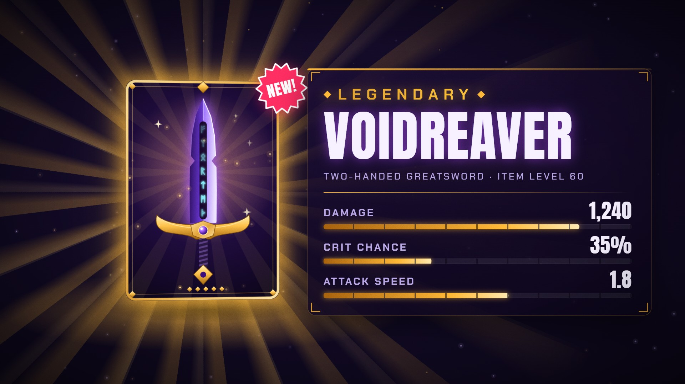
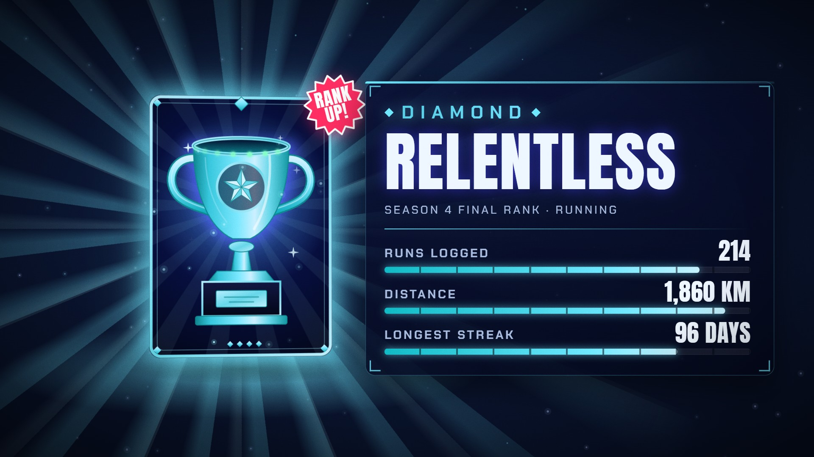

# Loot Reveal · `gaming-loot-reveal`



A card drops in spinning, lands with a squash and climbs a rarity ladder. Every tier hit recolours it, shakes
harder and rings a higher note while the odds readout rolls underneath. Sparks implode on a riser, a white
flash hides the flip, and the item lands beside a tooltip: the rarity line shimmers, the name decodes through
an RGB-split glitch and the stats count up on a stagger. The art is drawn in code and picked with
`item.icon`, and the top tier's colour re-tints the whole reveal.

<!-- catalog:start · generated by tools/catalog.mjs from style.js; edit the style, then rerun -->
| | |
|---|---|
| **Style id** | `gaming-loot-reveal` |
| **Primary niches** | Gaming · RPG & looter games · Game item & patch breakdowns |
| **Also fits** | Trading-card pack openings · Mobile gacha pulls · Fitness app rank-ups · Esports rank reveals · Creator milestones · Study & habit streaks · Fantasy sports player cards |
| **Length** | 7.0 s · poster frame 6.6 s · 40 sound cues |
| **Palette** | `#FFB938` `#B04DFF` `#0A0614` |
| **Techniques** | 3D card flip with rarity escalation · Charge, white flash and particle burst · Glitch-in name with counted stats |

**Why it retains:** Four rarity steps turn the wait into a ladder the viewer has to see the top of, and the flash pays it off in a single frame.

**Retention beats** (the editing decisions, in order)

| t | beat |
|---:|---|
| 0.00 s | Card is already falling and spinning on frame one |
| 0.80 s | Four tiers, each brighter, louder and shakier than the last |
| 3.15 s | Anticipation: sparks implode while the riser climbs |
| 3.50 s | White flash hides the swap to the card front |
| 4.05 s | Name decodes with an RGB split; stats count in on a stagger |

**Showcase card:** Gaming · *Legendary Drop*  
**Facts:** Fictional item, stats and drop rates.

**Examples**

| params | niche | title | frame |
|---|---|---|---|
| defaults | Gaming | Legendary Drop |  |
| [`examples/fitness-rank-up.json`](examples/fitness-rank-up.json) | Fitness app rank-ups | Diamond Season |  |

**Render**

```bash
node tools/render.mjs sheet gaming-loot-reveal
node tools/render.mjs video gaming-loot-reveal --params styles/gaming-loot-reveal/examples/fitness-rank-up.json
```

<details><summary>Default params (copy into a params file and change what you need)</summary>

```json
{
  "tiers": [
    { "name": "COMMON", "color": "#9AA0A6", "chance": "62%" },
    { "name": "RARE", "color": "#3D8BFF", "chance": "24%" },
    { "name": "EPIC", "color": "#B04DFF", "chance": "8.5%" },
    { "name": "LEGENDARY", "color": "#FFB938", "chance": "0.4%" }
  ],
  "chanceLabel": "DROP CHANCE",
  "cardBack": { "glyph": "?", "label": "LOOT DROP" },
  "item": {
    "name": "VOIDREAVER",
    "type": "TWO-HANDED GREATSWORD · ITEM LEVEL 60",
    "icon": "blade",
    "pips": 5
  },
  "stats": [
    { "label": "DAMAGE", "value": 1240, "max": 1500, "unit": "" },
    { "label": "CRIT CHANCE", "value": 35, "max": 100, "unit": "%" },
    { "label": "ATTACK SPEED", "value": 1.8, "max": 3, "unit": "" }
  ],
  "badge": "NEW!",
  "padNotes": [110, 130.8, 164.8, 196],
  "droneHz": 49,
  "chordNotes": [523.3, 659.3, 784, 1046.5],
  "background": "radial-gradient(95% 85% at 50% 44%, #1D1036 0%, #120A25 46%, #0A0614 100%)",
  "colors": {
    "theme": "#765CB0",
    "flash": "#FFF8E8",
    "ink": "#F6F0FF",
    "muted": "#BBA9E8",
    "dim": "#7A68A3",
    "badge": "#FF2E63"
  }
}
```
</details>
<!-- catalog:end -->

## Params

| key | default | what it controls · limits |
|---|---|---|
| `tiers` | COMMON → LEGENDARY (4) | the ladder, bottom to top. 1–6 tiers (3–5 read best); past 6 the top six are kept. The hits always spread over 0.8–2.6 s, and shake, sparks, glow, rays and the rising tone scale with rank, so 4 tiers reproduce the showcase exactly |
| `tiers[].name` | `COMMON`, `RARE`, `EPIC`, `LEGENDARY` | big label under the card; shrinks past 1180 px. The top tier's name is also the shimmering rarity line in the tooltip |
| `tiers[].color` | `#9AA0A6`, `#3D8BFF`, `#B04DFF`, `#FFB938` | card edge, rays, sparks and label for that tier (`#RRGGBB`). **The top tier's colour re-tints the whole reveal**: frame, metal, tooltip accents, bars, embers and flash |
| `tiers[].chance` | `62%`, `24%`, `8.5%`, `0.4%` | value shown after `chanceLabel` while that tier is up. Free text (`TOP 8%`, `1 IN 250`); `""` shows nothing |
| `chanceLabel` | `DROP CHANCE` | label of the odds line. The line hides when this and every `chance` are empty; shrinks past 1180 px |
| `cardBack.glyph` | `?` | glyph in the diamond on the card back. 1–3 characters (`★`, `5★`); shrinks past 124 px |
| `cardBack.label` | `LOOT DROP` | small caps line on the card back; shrinks past 330 px (about 18 characters) |
| `item.name` | `VOIDREAVER` | decodes in with an RGB split. One line at 150 px up to 840 px (about 11 capitals); longer names shrink, and a multi-word name that would drop under 90 px breaks onto two balanced lines instead |
| `item.type` | `TWO-HANDED GREATSWORD · ITEM LEVEL 60` | type / flavour line under the name; shrinks past 840 px. `""` removes the row |
| `item.icon` | `blade` | the drawn art: `blade` (rune-lit greatsword), `trophy` (cup on a plinth), `gem` (brilliant cut). Unknown names fall back to `blade` |
| `item.pips` | `5` | rarity pips under the art, 0–7 |
| `stats` | DAMAGE, CRIT CHANCE, ATTACK SPEED | 0–4 rows (extra rows are dropped). They stagger over the same 4.56–5.24 s window whatever the count, and the tooltip resizes and stays centred on the card |
| `stats[].label` | `DAMAGE` … | left of the row; shrinks to fit beside the value (about 20 characters at full size) |
| `stats[].value` | `1240`, `35`, `1.8` | counts up from 0 with thousands separators. Decimals follow the value as written (`1.8` → one) unless you add `decimals` |
| `stats[].max` | `1500`, `100`, `3` | bar fill = value ÷ max, to the nearest 1% |
| `stats[].unit` | `""`, `%`, `""` | suffix (`%`, ` KM`, ` DAYS`). Optional extra keys: `prefix` (`+`, `$`) and `decimals` |
| `badge` | `NEW!` | starburst on the card's corner at 6.0 s. One line up to about 5 capitals; two words break onto two lines (`RANK UP!`). `""` hides it and its sound |
| `padNotes` | `[110, 130.8, 164.8, 196]` | pad chord under the piece (Hz). The default is A minor 7 |
| `droneHz` | `49` | low drone under the piece (Hz) |
| `chordNotes` | `[523.3, 659.3, 784, 1046.5]` | the chord that lands with the rarity line (Hz). The tier tones climb a D major ladder in code |
| `background` | purple radial gradient | CSS background of the stage (skipped for `--alpha` renders) |
| `colors.theme` | `#765CB0` | the card's colour before the first tier, and the anchor of the scene's purple family: card faces, motes, fall trail, tooltip, the blade and the item aura all re-tint to it |
| `colors.flash` | `#FFF8E8` | the white-hot colour of the tier hits and the charge |
| `colors.ink`, `colors.muted`, `colors.dim` | `#F6F0FF`, `#BBA9E8`, `#7A68A3` | name and values · type line, stat labels and odds · odds label |
| `colors.badge` | `#FF2E63` | starburst fill (its shadow follows) |
| `palette`, `meta`, `bg` | from style.js | portfolio swatches, card copy (`niche`, `title`, `why`, `facts`), page background |

## Adapting it

- **Fitness app rank-ups** (the example): tiers `BRONZE`, `SILVER`, `GOLD`, `DIAMOND` with
  `chanceLabel: "RANKED IN THE"` and chances like `TOP 8%`; `item.icon: "trophy"`, `badge: "RANK UP!"`, a navy
  `colors.theme` and `background`. The cyan top tier turns the trophy, frame and bars to ice.
- **Mobile gacha pulls**: tiers `R`, `SR`, `SSR`, `UR` with the game's published pull rates as `chance`
  (`chanceLabel: "PULL RATE"`), `cardBack: { "glyph": "★", "label": "SUMMON" }`, `item.icon: "gem"` or `blade`
  and `item.pips: 5`. Real rates go in `meta.facts` with their source.
- **Trading-card pack openings**: five tiers (`COMMON`, `UNCOMMON`, `RARE`, `HOLO RARE`, `SECRET RARE`),
  `cardBack.label: "BOOSTER PACK"`, `item.icon: "gem"`, and stats such as `HP`, `ATTACK` and a price with
  `prefix: "$"`. Keep the card names fictional.
- **Creator milestones**: tiers `1K`, `10K`, `100K`, `1M` with `chanceLabel: ""` and empty chances,
  `item.icon: "trophy"`, `item.name: "100K CLUB"`, and stats like `VIDEOS`, `WATCH HOURS`, `COUNTRIES`.
- **Re-skin for a channel**: `colors.theme` + `background` for the mood, the top tier's `color` for the payoff,
  and `palette` for the portfolio card.

## Limits

- The art is drawn in code: `blade`, `trophy` and `gem`. Any other object (a sneaker, a character) needs a new
  icon function in style.js; the params can't draw it.
- 1–6 tiers. Two tiers leave a 1.8 s wait between hits, and one tier skips the climb. The ladder always spans
  0.8–2.6 s and the reveal always lands at 3.5 s; `duration` is fixed at 7 s.
- Names past about 24 characters get small even on two lines, and stat labels past about 20 characters shrink
  under 22 px. Keep both short.
- The top tier's colour drives the reveal through one colour family: a dark or grey top colour gives a dull
  payoff. Bright, saturated top colours work best.
- Chances are free text. Real drop or pull rates must come from the game's published rate table, and
  `meta.facts` must cite it; otherwise say they are fictional.
