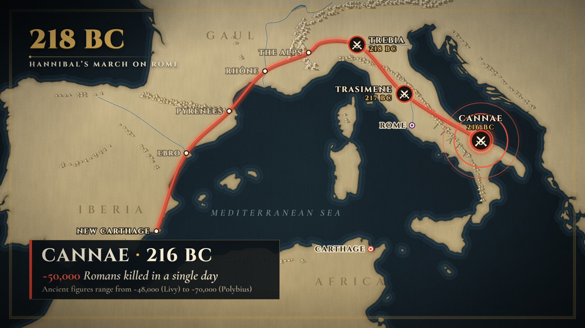
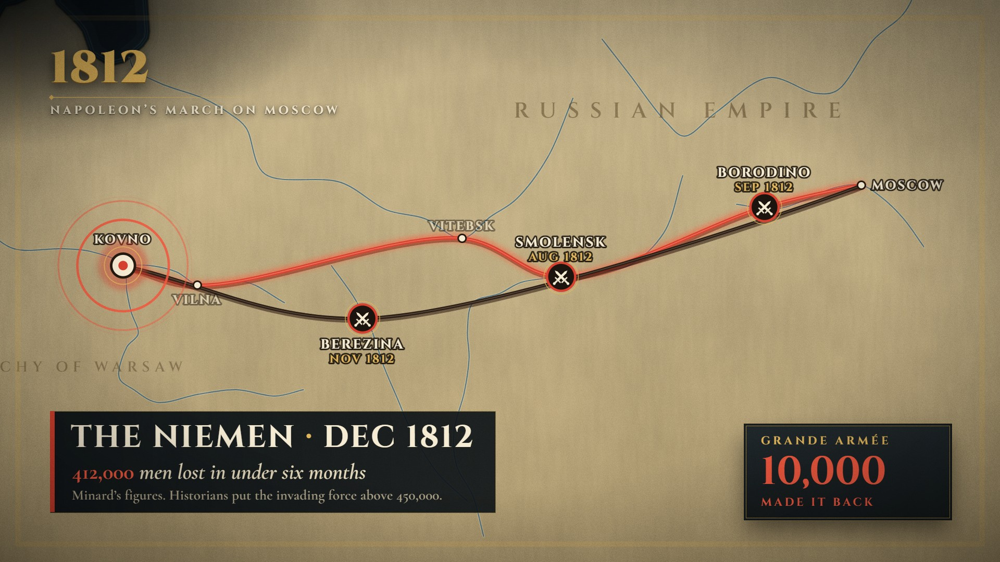

# Campaign Map · `history-campaign-map`



An antique map built from real coastline data fades up under a slammed date. An army token marches a
smooth route with the camera riding its head, and each stop pays off with a pin, a storm or a battle. A
weather beat drives the army counter down, the camera pulls wide to reveal the whole route, and the last
stop lands hardest: shock rings, a red flash and a lower third with a counting number.

<!-- catalog:start · generated by tools/catalog.mjs from style.js; edit the style, then rerun -->
| | |
|---|---|
| **Style id** | `history-campaign-map` |
| **Primary niches** | Ancient history · Military history · History explainers |
| **Also fits** | Napoleonic & modern campaigns · Data storytelling (Minard-style) · Exploration & expeditions · Polar & mountaineering disasters · Historical migrations · Trade routes & caravans · Road-trip & travel recaps |
| **Length** | 9.0 s · poster frame 8.4 s · 62 sound cues |
| **Palette** | `#D8412F` `#E2B65C` `#16222A` |
| **Techniques** | Follow-cam on a live route head · Antique map from real coastline data · Weather beat drives a falling counter |

**Why it retains:** The camera rides the army token so the eye never hunts; every stop pays off with a pin, a storm or a battle, and the army count falls before the biggest number lands at Cannae.

**Retention beats** (the editing decisions, in order)

| t | beat |
|---:|---|
| 0.14 s | The date slams in on a drum hit while the map fades up |
| 0.85 s | Camera rides the army token so the eye never searches |
| 3.55 s | Storm beat: snow, wind and the army count falling |
| 4.50 s | Pull-out reveals the whole route right as the battles start |
| 6.42 s | Cannae lands hardest: pulse rings, then the big number |

**Showcase card:** History · *Hannibal's March*  
**Facts:** Polybius, Histories III: ~38,000 infantry, 8,000 cavalry and 37 elephants at the Rhône; ~20,000 infantry and 6,000 cavalry reached Italy. Trebia 218, Trasimene 217, Cannae 216 BC; Cannae dead ~50,000 (Livy ~48,000, Polybius ~70,000). Natural Earth 50m coastline; route and Alpine pass are schematic.

**Examples**

| params | niche | title | frame |
|---|---|---|---|
| defaults | History | Hannibal's March |  |
| [`examples/napoleon-1812.json`](examples/napoleon-1812.json) | Data storytelling | Minard's March |  |

**Render**

```bash
node tools/render.mjs sheet history-campaign-map
node tools/render.mjs video history-campaign-map --params styles/history-campaign-map/examples/napoleon-1812.json
```

<details><summary>Default params (copy into a params file and change what you need)</summary>

```json
{
  "map": "med",
  "date": "218 BC",
  "title": "HANNIBAL’S MARCH ON ROME",
  "route": [
    { "name": "NEW CARTHAGE", "lon": -0.98, "lat": 37.6 },
    { "name": "EBRO", "lon": 0.6, "lat": 40.8, "size": 22 },
    { "name": "PYRENEES", "lon": 2.86, "lat": 42.46 },
    { "name": "RHÔNE", "lon": 4.75, "lat": 44, "count": 46000, "note": "AT THE RHÔNE" },
    { "name": "THE ALPS", "lon": 7.05, "lat": 44.7, "kind": "storm" },
    {
      "name": "TAURINI",
      "lon": 7.69,
      "lat": 45.07,
      "kind": "via",
      "count": 26000,
      "note": "REACHED ITALY"
    },
    { "name": "TREBIA", "lon": 9.6, "lat": 45, "kind": "battle", "year": "218 BC", "label": "right" },
    { "name": "TRASIMENE", "lon": 12.1, "lat": 43.13, "kind": "battle", "year": "217 BC" },
    {
      "name": "CANNAE",
      "lon": 16.13,
      "lat": 41.3,
      "kind": "battle",
      "year": "216 BC",
      "label": "above"
    }
  ],
  "weather": "snow",
  "token": "elephant",
  "counter": {
    "label": "HANNIBAL’S ARMY",
    "side": "left",
    "stat": { "label": "ELEPHANTS", "value": "37", "icon": "elephant" }
  },
  "cities": [
    { "name": "ROME", "lon": 12.5, "lat": 41.9, "color": "#5A2A6E", "label": "left" },
    { "name": "CARTHAGE", "lon": 10.32, "lat": 36.85, "color": "route", "label": "left" }
  ],
  "finale": {
    "title": "{name}",
    "date": "{year}",
    "value": 50000,
    "prefix": "~",
    "suffix": "",
    "line": "{value} Romans killed in a single day",
    "note": "Ancient figures range from ~48,000 (Livy) to ~70,000 (Polybius)"
  },
  "camera": {
    "zoom": 1,
    "wide": [1030, 660, 0.94],
    "end": [1070, 650, 1]
  },
  "rivers": [
    [
      [-4.05, 43],
      [-3.3, 42.75],
      [-2.45, 42.47],
      [-1.6, 42.05],
      [-0.88, 41.65],
      [-0.1, 41.25],
      [0.45, 41],
      [0.55, 40.82],
      [0.86, 40.72]
    ],
    [
      [8.3, 46.55],
      [7.6, 46.24],
      [7, 46.2],
      [6.9, 46.38],
      [6.15, 46.21],
      [5.82, 45.95],
      [5.35, 45.82],
      [4.83, 45.76],
      [4.86, 45.2],
      [4.74, 44.55],
      [4.8, 43.95],
      [4.63, 43.68],
      [4.72, 43.38]
    ],
    [
      [7.1, 44.7],
      [7.45, 44.87],
      [7.69, 45.07],
      [8.2, 45.15],
      [8.8, 45.07],
      [9.7, 45.05],
      [10.3, 45],
      [10.9, 45.05],
      [11.6, 45.02],
      [12.1, 44.97],
      [12.46, 44.95]
    ],
    [
      [12.07, 43.78],
      [12.25, 43.4],
      [12.39, 43.1],
      [12.45, 42.7],
      [12.55, 42.35],
      [12.48, 41.9],
      [12.25, 41.74]
    ]
  ],
  "lakes": [
    [[6.16, 46.24], [6.4, 46.36], [6.65, 46.44], [6.86, 46.42]]
  ],
  "mountains": [
    {
      "size": 10,
      "spacing": 9,
      "jitter": 10,
      "pts": [
        [-1.75, 43.1],
        [-0.9, 42.88],
        [0, 42.74],
        [0.9, 42.64],
        [1.8, 42.5],
        [2.55, 42.44],
        [3, 42.4]
      ]
    },
    {
      "size": 12.5,
      "spacing": 9,
      "jitter": 14,
      "snow": true,
      "pts": [
        [7.55, 43.97],
        [7, 44.22],
        [6.72, 44.6],
        [6.62, 45.1],
        [6.88, 45.62],
        [7.5, 45.96],
        [8.3, 46.22],
        [9.2, 46.42],
        [10.2, 46.42],
        [11.2, 46.58],
        [12.3, 46.56],
        [13.3, 46.45],
        [14.2, 46.5],
        [15.3, 47.15]
      ]
    },
    {
      "size": 10,
      "spacing": 10,
      "jitter": 6,
      "snow": true,
      "keep": 0.9,
      "pts": [
        [6.02, 44.35],
        [6.2, 44.9],
        [6.42, 45.4],
        [6.8, 45.95]
      ]
    },
    {
      "size": 8.5,
      "spacing": 10,
      "jitter": 7,
      "pts": [
        [8.7, 44.45],
        [9.6, 44.45],
        [10.4, 44.24],
        [11.2, 44.04],
        [12, 43.66],
        [12.7, 43.16],
        [13.3, 42.62],
        [13.9, 42.06],
        [14.5, 41.56],
        [15.1, 41.06],
        [15.6, 40.56],
        [15.95, 40],
        [16.15, 39.35],
        [16.25, 38.8]
      ]
    },
    {
      "size": 7,
      "spacing": 14,
      "jitter": 6,
      "keep": 0.8,
      "pts": [
        [-6.4, 40.25],
        [-5.2, 40.32],
        [-4, 40.74],
        [-3.4, 41.1]
      ]
    },
    {
      "size": 7,
      "spacing": 14,
      "jitter": 6,
      "keep": 0.8,
      "pts": [
        [-3.9, 37.06],
        [-2.9, 37.12],
        [-2.3, 37.26]
      ]
    },
    {
      "size": 7,
      "spacing": 14,
      "jitter": 6,
      "keep": 0.8,
      "pts": [
        [-6.4, 43],
        [-5, 43.06],
        [-3.8, 43.12]
      ]
    },
    {
      "size": 7,
      "spacing": 14,
      "jitter": 6,
      "keep": 0.8,
      "pts": [
        [-2.9, 41.95],
        [-2, 41.3],
        [-1.3, 40.62],
        [-0.9, 40.1]
      ]
    },
    {
      "size": 7,
      "spacing": 14,
      "jitter": 6,
      "keep": 0.8,
      "pts": [
        [3.1, 45.3],
        [3.35, 44.85],
        [3.6, 44.35]
      ]
    },
    {
      "size": 7,
      "spacing": 14,
      "jitter": 6,
      "keep": 0.8,
      "pts": [
        [-1, 35.3],
        [1, 35.95],
        [3, 36.3],
        [5, 36.32],
        [7, 36.3]
      ]
    },
    {
      "size": 7,
      "spacing": 14,
      "jitter": 6,
      "keep": 0.8,
      "pts": [
        [-5.5, 35.02],
        [-4.3, 35.06],
        [-3.3, 35.12]
      ]
    },
    {
      "size": 7,
      "spacing": 14,
      "jitter": 6,
      "keep": 0.8,
      "pts": [
        [14.6, 45.5],
        [15.8, 44.6],
        [17, 43.8],
        [18.2, 43],
        [19, 42.5]
      ]
    },
    { "size": 7, "spacing": 14, "jitter": 6, "keep": 0.8, "pts": [[8.95, 42.35], [9.15, 41.9]] }
  ],
  "labels": [
    { "text": "IBERIA", "lon": -3.4, "lat": 38.35, "size": 36, "spacing": 18, "opacity": 0.6 },
    { "text": "GAUL", "lon": 2.9, "lat": 45.2, "size": 36, "spacing": 18, "opacity": 0.6 },
    {
      "text": "ITALY",
      "lon": 14.45,
      "lat": 41.2,
      "size": 30,
      "spacing": 16,
      "opacity": 0.66,
      "along": [
        [11.4, 43.55],
        [15.4, 40.75]
      ]
    },
    { "text": "AFRICA", "lon": 9.2, "lat": 35.3, "size": 36, "spacing": 18, "opacity": 0.55 },
    {
      "text": "MEDITERRANEAN SEA",
      "lon": 5.3,
      "lat": 38.25,
      "size": 30,
      "spacing": 9,
      "opacity": 0.85,
      "sea": true
    }
  ],
  "padNotes": [110, 130.8, 164.8, 220],
  "droneHz": 46.25,
  "colors": {
    "route": "#D8412F",
    "routeHi": "#F0583F",
    "routeGlow": "#FF5A3A",
    "routeCore": "#FF9A80",
    "routeShadow": "#1E0905",
    "routeBack": "#2B1E16",
    "routeBackCore": "#7A6650",
    "gold": "#E2B65C",
    "goldShadow": "#7A5A22",
    "cream": "#F6ECD4",
    "parchment": "#E9DDBF",
    "ink": "#231910",
    "titleText": "#F1E6CB",
    "muted": "#A89C85",
    "footnote": "#B3A98F",
    "panel": "#0D1317",
    "panelTop": "#182127",
    "shade": "#070B0E",
    "labelHalo": "#140E08",
    "cityHalo": "#F0E4C6",
    "battleDisc": "#1C140F",
    "shock": "#FFD9C9",
    "tokenRing": "#8E2416",
    "iconCut": "#16202A",
    "flash": "#FF7850",
    "bg": "#0E171C"
  },
  "mapColors": {
    "sea": ["#1B2B34", "#16222A", "#0C1418"],
    "land": ["#D3C29B", "#C8B68C", "#B6A276"],
    "waterLines": ["#2B4452", "#4C6876", "#30505E"],
    "landShade": "#4E3E24",
    "coast": "#6F5E3E",
    "river": "#5B7C8A",
    "riverEdge": "#E4D7B4",
    "mountains": ["#5E4D30", "#E4D6B0", "#977F55", "#FBF8EF"],
    "landLabel": "#6B5736",
    "seaLabel": "#8AA2AE"
  }
}
```
</details>
<!-- catalog:end -->

## Params

| key | default | what it controls · limits |
|---|---|---|
| `map` | `med` | region key in `data/mapdata.js`. See "Adding a map region" below |
| `date` | `218 BC` | big gold date, top left. Shrinks past 1000 px |
| `title` | `HANNIBAL’S MARCH ON ROME` | letter-spaced line under the date. Shrinks past 1100 px |
| `route` | 9 stops, New Carthage to Cannae | 4–12 stops in marching order (more are ignored). The march runs 0.85 → 6.42 s: every leg takes the same time and the storm leg takes 1.3×. Nine stops with the storm fifth keeps the showcase's hand-tuned rhythm |
| `route[].name`, `lon`, `lat` | | label text (`""` hides it) and position in degrees |
| `route[].kind` | `pin` | `pin` · `storm` (one stop, not the first or last: weather beat, pin drops low) · `battle` (crossed swords + drum) · `via` (no marker, still takes a time slot) |
| `route[].label` | `left` (last stop `above`) | label side: `left` · `right` · `above` · `below`. Nothing moves labels automatically, so pick sides clear of the route |
| `route[].size` | 24 · battles 26 · last stop 28 | label size in px |
| `route[].year` | `""` | second line under a battle or the last stop, and `{year}` in `finale` |
| `route[].count`, `note` | Rhône 46,000 "AT THE RHÔNE" · Taurini 26,000 "REACHED ITALY" | the army counter. It appears at the first stop with a count and rolls to each next count, landing on that stop with a −/+ badge and the new note. A roll starts 0.17 s after the storm if the storm sits on that stretch, otherwise 0.77 s after the previous count lands |
| `route[].turn` | — | `true` on one stop: the route after it is drawn in `colors.routeBack` (a return journey). A route that ends where it began moves the first label clear of the finale marker |
| `weather` | `snow` | `snow` · `rain` · `sand` · `none`. Wash, particles, wind and shake around the storm stop |
| `token` | `elephant` | army token: `elephant`, a 1–3 letter monogram (`N`, `L&C`), or `none` |
| `counter.label` | `HANNIBAL’S ARMY` | counter heading. Shrinks to the column |
| `counter.side` | `left` | `left`: bottom left, exits 0.73 s after the last count (5.15 s at the earliest, 6.2 s at the latest, before the lower third). `right`: bottom right, stays to the end. Use `right` when a count lands on the last stop |
| `counter.stat` | `{ label: "ELEPHANTS", value: "37", icon: "elephant" }` | second, static column. `icon` is `elephant` or omitted. `null` hides it |
| `cities` | Rome (purple), Carthage (`route`) | 0–4 reference cities that pop as the camera pulls wide (5.0 s + 0.25 s each): `name`, `lon`, `lat`, `color` (hex or a `colors` key), `label` (`left` · `right`) |
| `finale.title`, `finale.date` | `{name}`, `{year}` | lower-third heading, joined by a gold dot. Placeholders come from the last stop |
| `finale.value`, `prefix`, `suffix` | `50000`, `~`, `""` | number that counts up where `{value}` sits in `line`. `null` = plain text |
| `finale.line` | `{value} Romans killed in a single day` | lower-third line |
| `finale.note` | Livy/Polybius range | footnote for sources. `""` hides it. The plate grows to 1100 px for long lines, then text shrinks |
| `camera.zoom` | `1` | multiplies the follow-cam zoom (2.34 → 1.56 × the region frame). Raise it for large regions |
| `camera.wide` | `[1030, 660, 0.94]` | `[x, y, zoom]` in map px as the pull-out lands (5.95 s). The region's own frame is `[960, 540, 1]`. `null` = fit the route and cities |
| `camera.end` | `[1070, 650, 1]` | `[x, y, zoom]` on the last frame. `null` = a slow push from `wide` |
| `rivers` | Ebro, Rhône, Po, Tiber | polylines of `[lon, lat]`, smoothed, drawn as inked water |
| `lakes` | Lake Geneva | polylines drawn as thick water strokes |
| `mountains` | 13 ridge lines | `{ pts, size, spacing, jitter, snow, keep }`: triangle glyphs scattered along each ridge (seeded; sizes in map px, `keep` = share drawn) |
| `labels` | Iberia, Gaul, Italy, Africa, Mediterranean Sea | map lettering: `{ text, lon, lat, size, spacing, opacity, sea, along }`. `sea: true` uses italic Garamond. `along: [[lon,lat],[lon,lat]]` sets the angle. Upright labels fade while they pass under the title |
| `padNotes` | `[110, 130.8, 164.8, 220]` | pad chord under the finale (Hz) |
| `droneHz` | `46.25` | low drone under the whole piece |
| `colors.route`, `routeHi` | `#D8412F`, `#F0583F` | route line, token, battle rings, lower-third bar · falling counter, badges, pulse rings |
| `colors.routeBack`, `routeBackCore` | `#2B1E16`, `#7A6650` | the return leg after a `turn` stop |
| `colors.*` | see defaults | `routeGlow` · `routeCore` · `routeShadow` · `gold` · `goldShadow` · `cream` · `parchment` · `ink` · `titleText` · `muted` · `footnote` · `panel` · `panelTop` · `shade` · `labelHalo` · `cityHalo` · `battleDisc` · `shock` · `tokenRing` · `iconCut` · `flash` · `bg` |
| `mapColors.*` | antique parchment | `sea` (3 stops) · `land` (3 stops) · `waterLines` (3) · `landShade` · `coast` · `river` · `riverEdge` · `mountains` (outline, light, shade, snow) · `landLabel` · `seaLabel` |
| `palette`, `meta`, `bg` | from style.js | portfolio swatches, card copy (`niche`, `title`, `why`, `facts`), page background |

## Adapting it

- **Napoleonic and modern campaigns:** see [`examples/napoleon-1812.json`](examples/napoleon-1812.json).
  It uses the `russia1812` region, counts on the first, turning and last stops (422,000 → 100,000 → 10,000),
  `turn: true` at Moscow so the retreat is drawn in dark ink like Minard's chart, and the storm on Moscow
  itself. It also uses a right-side counter that stays to the end, an `N` monogram token and a pin finale.
- **Exploration and expeditions (Lewis & Clark, 1804–06):** add a `plains` region around 90–124°W and
  38–49°N, then use pins for the camps and `storm` on the Lolo Trail crossing. Set `counter.label: "CORPS OF
  DISCOVERY"` with counts on the stops, `token: "L&C"`, `cities: []` and a pin finale at Fort Clatsop.
  Set `finale.value: null` if the payoff is a sentence rather than a number.
- **Polar and mountaineering disasters:** keep `weather: "snow"` and put the storm on the ice or summit
  push. Use counts for men or supplies, and `battle` only for real clashes. Tone down `padNotes` to a minor
  chord.
- **Trade routes, caravans, road trips:** use `weather: "sand"` (or `none`) and pins only. A counter can
  rise: a larger count lands with a `+` badge. Use `token` monograms, `counter.stat: null`, and warmer
  `mapColors`.
- **Adding a map region:** add an entry to `data/maps.config.json` such as
  `"plains": { "bounds": [[-124, 38], [-90, 49]], "pad": 20, "clip": 700 }`, then run
  `node tools/mapgen.mjs`. The bounds become the 1920×1080 frame at zoom 1 (Mercator, Natural Earth 50m),
  and `clip` keeps land beyond it for camera moves. Keep the route inside the bounds. Rivers, lakes,
  mountains and labels are params, so draw them per story. Don't change existing regions; other styles'
  goldens depend on them.

## Limits

- 4–12 stops, one storm (not on the first or last stop), 0–4 cities. The last stop always gets the finale
  treatment, with battle swords or a big pin.
- The camera follows the route head until 4.5 s and is wide from 5.95 s. Stops after 4.5 s play in the
  wide shot, and pins met before the pull-out dim to 55% there.
- Labels are not collision-solved. Choose `label` sides so text stays off the route, and keep map
  `labels` short: they zoom with the map (a 36 px label is about 80 px on screen in the follow-cam).
- On a left-side counter, a count that lands after about 5.5 s is barely seen. Put it on the right.
- The spline doesn't follow roads or coasts. Add stops (`via` hides their markers) to steer it; the route
  is schematic, and `facts` should say so.
- Rings, flashes, drums and braams read as conflict. For peaceful journeys pick `weather`, `padNotes`
  and colours that soften it; the sound design itself stays in code.
- Map data is Natural Earth 50m land only (no borders, small islands can be missing). Regions spanning
  more than about 40° of longitude need `camera.zoom` above 1.
- `meta.facts` must cite every number you put in `count`, `year` and `finale`.
