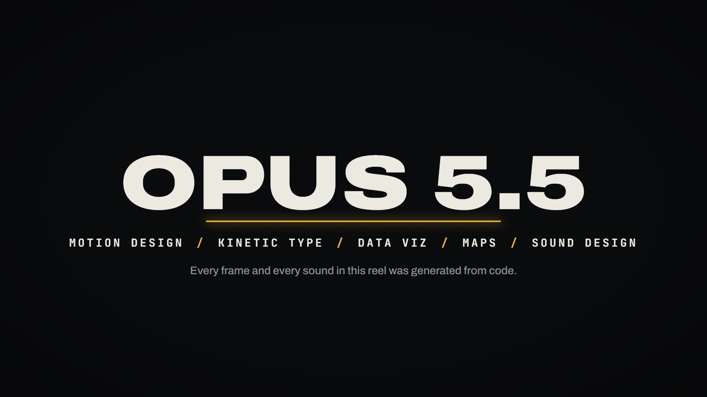
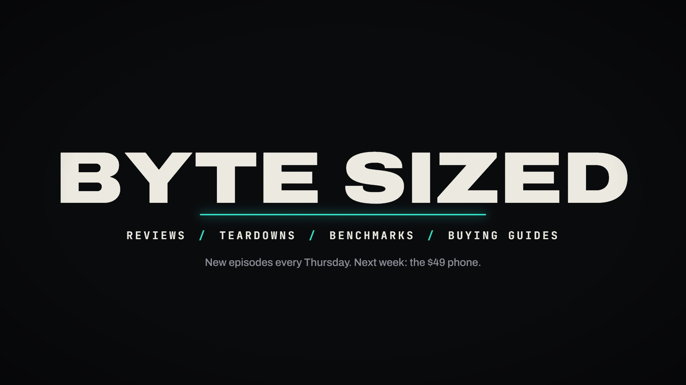

# Bars & Tone Close · `reel-close-bars`



The end card: an accent line draws, the title rises over it letter by letter, a roll-call of skills
ticks in on a rising pitch, and a closing note fades up. Then everything clears, the line spans the frame
turning white, and it opens back into the SMPTE bars the reel started on, with a tail tone. It is the
bookend for [`reel-open-bars`](../reel-open-bars/README.md).

<!-- catalog:start · generated by tools/catalog.mjs from style.js; edit the style, then rerun -->
| | |
|---|---|
| **Style id** | `reel-close-bars` |
| **Primary niches** | Showreel / portfolio end card · Channel outro |
| **Also fits** | Episode end card · Series or course wrap-up · Credits roll-call · Tech & broadcast channels · Retro / VHS themes |
| **Length** | 4.6 s · poster frame 2.9 s · 9 sound cues |
| **Palette** | `#F2B33D` `#ECE9E1` `#0A0B0D` |
| **Techniques** | Bookended open and close · Capability roll-call · Tail tone |

**Why it retains:** Ends where it began, so the reel feels designed as one piece rather than a playlist.

**Retention beats** (the editing decisions, in order)

| t | beat |
|---:|---|
| 0.80 s | Roll-call of the skills the reel just demonstrated |
| 3.62 s | Bookend: the reel closes on the signal it opened with |

**Showcase card:** Reel close · *End Card*  
**Facts:** Bars layout as in the open; the closing 1 kHz blip mirrors a broadcast tail tone.

**Examples**

| params | niche | title | frame |
|---|---|---|---|
| defaults | Reel close | End Card |  |
| [`examples/tech-channel-outro.json`](examples/tech-channel-outro.json) | Tech channel outro | Byte Sized end card |  |

**Render**

```bash
node tools/render.mjs sheet reel-close-bars
node tools/render.mjs video reel-close-bars --params styles/reel-close-bars/examples/tech-channel-outro.json
```

<details><summary>Default params (copy into a params file and change what you need)</summary>

```json
{
  "title": "OPUS 5.5",
  "roll": ["MOTION DESIGN", "KINETIC TYPE", "DATA VIZ", "MAPS", "SOUND DESIGN"],
  "note": "Every frame and every sound in this reel was generated from code.",
  "toneHz": 1000,
  "colors": { "accent": "#F2B33D", "ink": "#ECE9E1", "muted": "#8C8F99" }
}
```
</details>
<!-- catalog:end -->

## Params

| key | default | what it controls · limits |
|---|---|---|
| `title` | `OPUS 5.5` | end-card title. Shrinks past 1600 px |
| `roll` | 5 skills | 2–6 short items on one line, separated by accent slashes. Shrinks past 1700 px |
| `note` | `Every frame and every sound…` | closing sentence. Shrinks past 1600 px |
| `toneHz` | `1000` | tail-tone pitch |
| `colors.accent` | `#F2B33D` | line and slashes |
| `colors.ink`, `colors.muted` | `#ECE9E1`, `#8C8F99` | title/roll text and the note |
| `palette`, `meta`, `bg` | from style.js | portfolio swatches, card copy, page background |

## Adapting it

- **A new showreel:** `title` = the name or brand, `roll` = the skills the reel actually showed, and
  `note` = a contact line or a one-sentence claim.
- **Channel outro:** `roll` lists the channel's formats, and `note` teases the next episode (see
  `examples/tech-channel-outro.json`).
- **Course wrap-up:** `roll` lists the modules covered, and `note` says what's next.
- Always change the accent together with `reel-open-bars`, so the bookend matches.

## Limits

- The separators are visible from the start and only the words animate in, as in the showcase.
- One line each for the title, roll and note.
- The timing is fixed at 4.6 s. The bars open at 3.62 s.
