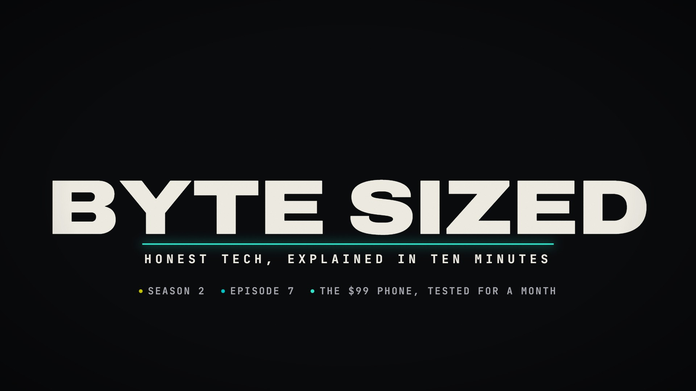

# Bars & Tone Open · `reel-open-bars`


SMPTE colour bars and a 1 kHz tone hold for half a second, with a burnt-in slate and a running timecode.
Then the picture collapses to a CRT line. The line glides down to become the title underline, the title's
letters rise out of it with a decaying RGB split, the subtitle drops from the line, and a short stat line
sets expectations. It pairs with [`reel-close-bars`](../reel-close-bars/README.md) as a bookend.

<!-- catalog:start · generated by tools/catalog.mjs from style.js; edit the style, then rerun -->
| | |
|---|---|
| **Style id** | `reel-open-bars` |
| **Primary niches** | Showreel / portfolio open · Channel intro |
| **Also fits** | Episode cold open · Documentary title card · Tech & broadcast channels · Retro / VHS themes · Course or series opener |
| **Length** | 3.6 s · poster frame 2.9 s · 9 sound cues |
| **Palette** | `#F2B33D` `#ECE9E1` `#0A0B0D` |
| **Techniques** | Broadcast test-signal open · CRT collapse into type · Letters rise out of the line |

**Why it retains:** Opens on a signal every editor recognises, then turns it into the title in under two seconds.

**Retention beats** (the editing decisions, in order)

| t | beat |
|---:|---|
| 0.00 s | Bars and tone: a signal every editor recognises |
| 0.86 s | The collapsed signal becomes the title underline |
| 1.02 s | Letters rise from the line with a decaying RGB split |
| 2.00 s | Three facts set expectations before the first piece |

**Showcase card:** Reel open · *Bars & Tone*  
**Facts:** SMPTE colour bars layout (ECR 1-1978): 75% bars, reverse-blue castellations, -I / white / +Q / PLUGE row, 1 kHz line-up tone.

**Examples**

| params | niche | title | frame |
|---|---|---|---|
| defaults | Reel open | Bars & Tone |  |
| [`examples/tech-channel-intro.json`](examples/tech-channel-intro.json) | Tech channel intro | Byte Sized, S02E07 |  |

**Render**

```bash
node tools/render.mjs sheet reel-open-bars
node tools/render.mjs video reel-open-bars --params styles/reel-open-bars/examples/tech-channel-intro.json
```

<details><summary>Default params (copy into a params file and change what you need)</summary>

```json
{
  "slate": "OPUS 5.5 — MOTION REEL",
  "timecodeStart": 3600,
  "title": "OPUS 5.5",
  "subtitle": "MOTION DESIGN FOR HIGH-RETENTION YOUTUBE",
  "stats": ["13 PIECES", "12 NICHES", "EVERY FRAME AND SOUND GENERATED FROM CODE"],
  "toneHz": 1000,
  "colors": { "accent": "#F2B33D", "ink": "#ECE9E1", "stats": "#A9ABB3" }
}
```
</details>
<!-- catalog:end -->

## Params

| key | default | what it controls · limits |
|---|---|---|
| `slate` | `OPUS 5.5 — MOTION REEL` | burnt-in window over the bars, top left. Cut with an ellipsis past 1300 px |
| `timecodeStart` | `3600` | burnt-in timecode start in seconds. 3600 = `01:00:00:00`, the broadcast convention; `0` starts at zero |
| `title` | `OPUS 5.5` | the big title. Shrinks past 1600 px; 4–12 characters look best |
| `subtitle` | `MOTION DESIGN FOR HIGH-RETENTION YOUTUBE` | tracked mono line under the underline. Shrinks past 1640 px |
| `stats` | 3 items | 1–4 short facts, one line. Dots take the bar colours and the last one takes the accent. Shrinks past 1700 px |
| `toneHz` | `1000` | line-up tone pitch |
| `colors.accent` | `#F2B33D` | underline and the last stat dot |
| `colors.ink`, `colors.stats` | `#ECE9E1`, `#A9ABB3` | title/subtitle and stat text |
| `palette`, `meta`, `bg` | from style.js | portfolio swatches, card copy, page background |

## Adapting it

- **A new showreel:** set `slate` to `YOUR NAME — MOTION REEL 2026`, `title` to the name or brand, and
  `stats` to counts that are true for the reel (`16 PIECES`, `9 NICHES`…).
- **Channel or episode intro:** `slate` carries the episode code, `timecodeStart: 0`, and the stats list the
  season, the episode and the episode's hook (see `examples/tech-channel-intro.json`).
- **Documentary title card:** use a serious one-line `subtitle`, a single stat (the date or place), and a
  muted accent such as `#C9C3B6`.
- **Retro/VHS channels:** keep the defaults and swap the accent for a hot magenta or cyan.

## Limits

- The bars are SMPTE-accurate and not themeable, by design: they only work if they read as real bars.
- One-line title only. Long titles shrink rather than wrap, so keep them short.
- The timing is fixed at 3.6 s. The stat line always lands at 2.0 s.
