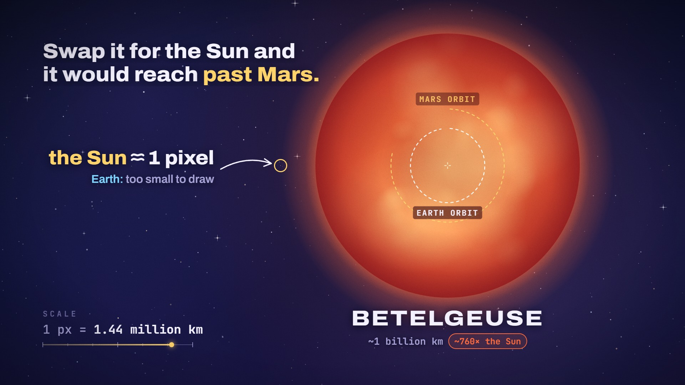
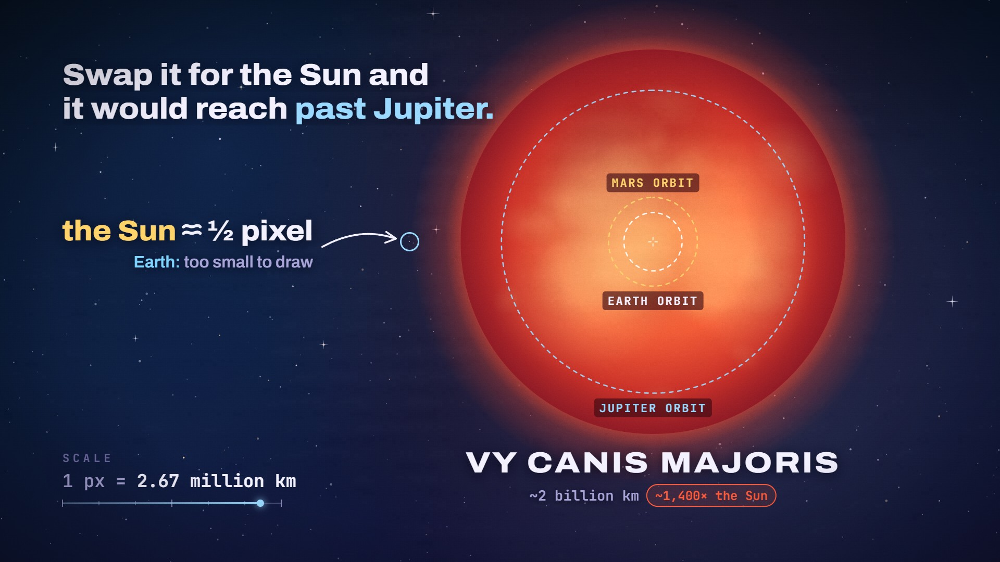

# True-Scale Zoom · `science-scale-zoom`



A ladder of spheres at true relative scale, redrawn on one canvas every frame. The opening frame pairs the two
smallest bodies. Then one log-zoom camera pulls back, pivoting on the gap between neighbours, so each body
shrinks into the point the eye is already on while the next giant edges in from the right. A live km-per-pixel
readout races along a log ruler. The last and longest zoom lands on the giant with a hit, a ringed callout
shows how small an earlier body has become, and orbits drawn inside the giant close the piece.

<!-- catalog:start · generated by tools/catalog.mjs from style.js; edit the style, then rerun -->
| | |
|---|---|
| **Style id** | `science-scale-zoom` |
| **Primary niches** | Space & astronomy · Science explainers · Science education |
| **Also fits** | Stars & stellar astronomy · Planetary science · Moons & dwarf planets · Exoplanets · Kids science & STEM · Sci-fi worldbuilding |
| **Length** | 9.0 s · poster frame 8.5 s · 28 sound cues |
| **Palette** | `#FF6B3D` `#FFD36B` `#1C1442` |
| **Techniques** | True-scale log-zoom camera · Zooms pivot on the gap between bodies · Live km-per-pixel readout |

**Why it retains:** Every zoom ends with the next giant already edging into frame, so the question renews itself until the payoff shrinks the Sun to a single pixel.

**Retention beats** (the editing decisions, in order)

| t | beat |
|---:|---|
| 0.14 s | Open on a question; Moon and Earth set the yardstick |
| 1.40 s | Zooms pivot on the gap between bodies, so the eye never jumps |
| 2.60 s | The next giant always edges into frame: a built-in cliffhanger |
| 4.60 s | Longest zoom saved for last while the scale readout races |
| 6.52 s | Braam and boom hit the first frame the whole giant fits |
| 7.20 s | Payoff made concrete: the Sun is now a single pixel |

**Showcase card:** Science & Space · *Scale of Giants*  
**Facts:** Mean diameters from NASA planetary fact sheets: Moon 3,474 km, Earth 12,742 km, Jupiter 139,820 km, Sun 1,392,700 km. Betelgeuse radius ~764 solar radii (Joyce et al. 2020; estimates span ~640-1,020), so ~1.06 billion km across and ~3.5 AU in radius, past Mars at 1.52 AU. Coastlines: Natural Earth 1:110m. Sizes to scale; spacing is not.

**Examples**

| params | niche | title | frame |
|---|---|---|---|
| defaults | Science & Space | Scale of Giants |  |
| [`examples/stars-to-scale.json`](examples/stars-to-scale.json) | Stars & stellar astronomy | Smaller Than Earth |  |

**Render**

```bash
node tools/render.mjs sheet science-scale-zoom
node tools/render.mjs video science-scale-zoom --params styles/science-scale-zoom/examples/stars-to-scale.json
```

<details><summary>Default params (copy into a params file and change what you need)</summary>

```json
{
  "eyebrow": "EVERYTHING TO SCALE",
  "headline": "How big can a star get?",
  "bodies": [
    {
      "id": "moon",
      "name": "MOON",
      "km": 3474,
      "look": "moon",
      "chip": "{ratio} Earth",
      "vs": "earth",
      "color": "#C9CCDA"
    },
    {
      "id": "earth",
      "name": "EARTH",
      "km": 12742,
      "look": "earth",
      "chip": "you are here",
      "color": "#7FD4FF"
    },
    {
      "id": "jupiter",
      "name": "JUPITER",
      "km": 139820,
      "look": "jupiter",
      "chip": "{ratio} Earth",
      "vs": "earth",
      "color": "#E9B886"
    },
    {
      "id": "sun",
      "name": "SUN",
      "km": 1392700,
      "look": "sun",
      "chip": "{ratio} Earth",
      "vs": "earth",
      "color": "#FFD36B"
    },
    {
      "id": "betelgeuse",
      "name": "BETELGEUSE",
      "rSun": 764,
      "approx": true,
      "look": "redSupergiant",
      "chip": "{ratio} the Sun",
      "vs": "sun",
      "color": "#FF6B3D"
    }
  ],
  "callout": {
    "body": "sun",
    "label": "the Sun",
    "one": "1 pixel",
    "many": "{n} pixels",
    "part": "{n} pixel"
  },
  "footnote": { "body": "earth", "label": "Earth:", "text": "too small to draw" },
  "orbits": [
    { "name": "Earth", "label": "EARTH ORBIT", "au": 1, "color": null },
    { "name": "Mars", "label": "MARS ORBIT", "au": 1.524, "color": "#FFD36B" }
  ],
  "closing": "Swap it for the Sun and\nit would reach *past {orbit}.*",
  "readout": { "label": "SCALE", "prefix": "1 px = " },
  "units": { "name": "km", "perKm": 1, "million": "million", "billion": "billion", "sunKm": 1392700 },
  "looks": {
    "moon": {
      "type": "rocky",
      "surface": ["#E0E2EA", "#A9ACBC"],
      "maria": "#7E8298",
      "crater": ["#E6E8EF", "#8F93A8", "#B7BACA"],
      "light": "#FFFFFF",
      "shade": "#0C0C2C",
      "dot": "#B9BCCA"
    },
    "earth": {
      "type": "earth",
      "ocean": ["#49A2F0", "#2E7AD8", "#1D55B0"],
      "land": ["#7AD98F", "#3E9C60"],
      "desert": "#E2CB84",
      "forest": "#2E8C54",
      "ice": ["#EEF6FF", "#F0F8FF"],
      "cloud": "#FFFFFF",
      "haze": "#96D7FF",
      "glow": "#6EC4FF",
      "light": "#C8EEFF",
      "shade": "#080A2E",
      "dot": "#4A9AEE"
    },
    "jupiter": {
      "type": "gas",
      "fill": "#BCA88F",
      "bands": ["#D6C4A6", "#E8DAC0", "#C79B70", "#F2E6CF", "#B97049", "#EFD7B1", "#E6C095", "#BD7A50", "#F3E5CC", "#CFA47C", "#E7D7BD", "#C8B195", "#B09C86"],
      "spot": ["#F6EAD6", "#CF5C3C", "#E3855B"],
      "ovals": "#F9F1E4",
      "limb": "#46261C",
      "light": "#FFF0D7",
      "shade": "#0E0A2C",
      "dot": "#D9B48C"
    },
    "sun": {
      "type": "star",
      "disk": ["#FFF8D8", "#FFE27E", "#FFB94A", "#FF9A3C"],
      "glow": "#FF9646",
      "halo": "#FFCE6E",
      "glowSize": 1,
      "prominence": "#FFA854",
      "granules": "#FFFAD6",
      "spots": ["#E88A34", "#B9561F"],
      "rim": "#FFECAA",
      "flare": ["#FFD68C", "#FFF4D2", "#FFBE6E", "#FFC878"],
      "pixel": "#FFF6CF"
    },
    "redSupergiant": {
      "type": "giant",
      "disk": ["#FFB86A", "#FF8246", "#EE5634", "#BC332A"],
      "glow": "#FF4E40",
      "halo": "#FF683C",
      "cells": ["#961A18", "#FFCE84"],
      "limb": "#6E0E1A",
      "bloom": ["#FF9664", "#FF785A"],
      "plate": "#3A080E"
    }
  },
  "padNotes": [110, 164.8, 220, 277.2, 329.6],
  "droneHz": 55,
  "background": "linear-gradient(165deg, #0B1026 0%, #10143A 48%, #1C1442 100%)",
  "colors": {
    "ink": "#F4F1FF",
    "muted": "#A9A4D8",
    "dim": "#716DA6",
    "accent": "#FFD36B",
    "shadow": "#040516",
    "marker": "#FFF8DC",
    "stars": ["#ECE9FF", "#ECE9FF", "#ECE9FF", "#DCE6FF", "#B9CFFF", "#FFE2BD"],
    "glint": "#F2F0FF",
    "dust": "#D6DAFF",
    "nebula": ["#6246BE", "#2860B4", "#AA4696", "#3C3296"]
  }
}
```
</details>
<!-- catalog:end -->

## Params

| key | default | what it controls · limits |
|---|---|---|
| `eyebrow` | `EVERYTHING TO SCALE` | mono label above the hook (keep it under ~50 characters) |
| `headline` | `How big can a star get?` | the opening question. About 33 characters fit at 86 px; longer ones shrink to fit 1,560 px |
| `bodies` | Moon, Earth, Jupiter, Sun, Betelgeuse | **3–6 bodies, smallest first.** `[0]` sits beside `[1]` in the opening frame, the middle ones are framed in turn, and the last is the giant. More than 6 keeps the first five and the last; fewer than 3 warns and falls back to the default list. 5 or 6 bodies run 9 s; 4 run 7.4 s and 3 run 5.8 s (everything after the last zoom starts 1.6 s earlier per missing body) |
| `bodies[].id` | `moon` … | referenced by `vs`, `callout.body` and `footnote.body` |
| `bodies[].name` | `MOON` … | big label under the body, and its small tag once it shrinks. About 15 characters fit at full size, then it shrinks |
| `bodies[].tag` | the name | optional shorter text for the small tag (`PROXIMA` for `PROXIMA CENTAURI`) |
| `bodies[].km` / `rSun` | `3474` … / `764` | size: `km` = diameter in km, or `rSun` = radius in solar radii (converted with `units.sunKm`). Everything else is computed from these |
| `bodies[].approx` | `true` on Betelgeuse | uncertain size: the size text keeps one figure (`~1 billion km`) and ratios two (`~760×`) |
| `bodies[].chip` | `{ratio} Earth` | pill next to the size. `{ratio}` = this body ÷ the `vs` body (`0.27×`, `11×`, `109×`, `~760×`). Plain text works too (`you are here`) |
| `bodies[].vs` | `earth` | the body `{ratio}` compares against (default: the second body) |
| `bodies[].color` | per body | the chip, leader line and callout colour for this body |
| `bodies[].look` | `moon` … | a preset name from `looks`, or an inline look object (see `looks`) |
| `bodies[].tint` | — | recolours the look for this body only: every colour moves to the tint's hue and saturation, and lightness scales with it (`"#C1653A"` turns the Moon preset into Mars) |
| `callout` | on `sun`, `the Sun` | the payoff ring and line at the end: `body` (default: the second-to-last body), `label`, and the size wording `one` (`1 pixel`), `many` (`{n} pixels`), `part` (`{n} pixel`, where `{n}` is ½, ⅓, ¼, ⅕ or ⅒). The size is computed from the final framing. `null` drops the callout and its footnote |
| `footnote` | `earth`, `Earth:`, `too small to draw` | second line under the callout: `label` in the body's colour, then `text` if that body is under 0.1 px at the end, otherwise its computed size in pixels |
| `orbits` | Earth 1 AU, Mars 1.524 AU | rings drawn inside the giant at true scale, centred where the Sun would sit (`name`, `label`, `au`, `color`; `color: null` is a white ring with an ink label). Only orbits smaller than the giant are drawn, up to 4 (the outermost). More than two start earlier so the last lands on time; labels that would cross a tighter ring move outside it |
| `closing` | `Swap it for the Sun and\nit would reach *past {orbit}.*` | closing line, top left. `\n` breaks the line, `*…*` is drawn in `colors.accent`, `{orbit}` = the name of the outermost orbit drawn (if none fits, a line that uses `{orbit}` is skipped). About 26 characters per line at full size; wider lines shrink to 830 px |
| `readout.label`, `readout.prefix` | `SCALE`, `1 px = ` | the scale readout, bottom left. The value and the log ruler are computed every frame |
| `units` | km | `name` (`km`, `mi`), `perKm` (0.621371 for miles), `million` and `billion` (the words), `sunKm` (solar diameter used for `rSun`, default 1,392,700) |
| `looks` | 5 presets | surface presets: `moon` (type `rocky`), `earth` (`earth`), `jupiter` (`gas`), `sun` (`star`), `redSupergiant` (`giant`). Add your own here: `{ "like": "sun", "tint": "#D4E2FF", "spots": null }` starts from a preset, recolours it and overrides keys |
| `looks.*` (rocky) | Moon | `surface` [light, dark], `maria`, `crater` [rim, floor, lit floor], `light` (rim light), `shade` (night side), `dot` (sub-pixel colour) |
| `looks.*` (earth) | Earth | `ocean` ×3, `land` ×2, `desert`, `forest`, `ice` [Greenland, Arctic], `cloud`, `haze`, `glow`, `light`, `shade`, `dot`. Real Natural Earth coastlines; tint is ignored |
| `looks.*` (gas) | Jupiter | `fill`, `bands` (13 belt and zone colours, any number cycles), `spot` [halo, spot, core] or `null`, `ovals` or `null`, `limb`, `light`, `shade`, `dot` |
| `looks.*` (star) | Sun | `disk` ×4 (centre → edge), `glow`, `halo`, `glowSize` (1 = the Sun's glow; 0.5 for a white dwarf), `prominence` or `null`, `granules`, `spots` [penumbra, umbra] or `null`, `rim`, `flare` ×4 (the lens streak when it lands), `pixel` (its colour at one pixel) |
| `looks.*` (giant) | Betelgeuse | `disk` ×4, `glow`, `halo`, `cells` [dark, light] convection cells, `limb`, `bloom` ×2 (the reveal flash), `plate` (orbit-label backing) |
| `padNotes`, `droneHz` | A-major pad, 55 Hz | the bed under the piece (Hz). The braam on the reveal sits at 49 Hz |
| `background` | indigo gradient | CSS background of the stage |
| `colors.accent` | `#FFD36B` | eyebrow, callout ring, ruler, the `*…*` highlight in `closing` |
| `colors.*` | see defaults | `ink` text · `muted` secondary text · `dim` readout label · `shadow` text-shadow colour · `marker` crosshair where the Sun would sit · `stars` (star colours, any count) · `glint` · `dust` · `nebula` (4 soft background clouds) |
| `palette`, `meta`, `bg` | from style.js | portfolio swatches, card copy (`niche`, `title`, `why`, `facts`), page background |

## Adapting it

- **Stars to scale** ([`examples/stars-to-scale.json`](examples/stars-to-scale.json)): Sirius B (a white dwarf
  smaller than Earth) beside Earth, then Proxima Centauri, the Sun and VY Canis Majoris. Three new looks built
  from presets (`whiteDwarf`, `redDwarf`, `redHypergiant`), sizes in `rSun` with the NASA solar radius in
  `units.sunKm`, a third orbit so the closing line computes "past Jupiter", and an ice-blue accent.
- **Planets to scale:** `bodies` Mars (`look: "moon"`, `tint: "#C1653A"`), Earth, Neptune
  (`look: { "like": "jupiter", "tint": "#4B70DD", "spot": null }`) and Jupiter. Set `orbits: []` and
  `callout: null` (nothing ends up tiny when the last step is only 3×), and write a literal `closing` such as
  `"Jupiter could swallow\n*every other planet* at once."`. Four bodies run 7.4 s.
- **Moons and dwarf planets:** Pluto (`look: "moon"`, `tint: "#C9A98A"`) beside the Moon, then Earth, the Sun
  and a giant. Point `callout.body` at the second-to-last body and let `footnote` name Pluto.
- **US kids' science:** keep any list and set `units: { "name": "mi", "perKm": 0.621371 }`. Every size, chip
  and the live readout switch to miles.
- **Sci-fi worldbuilding:** invent bodies with tinted looks and your own chips (`"home world"`), and say in
  `meta.facts` that the sizes are fictional.

## Limits

- Spheres on one line only: no rings (Saturn draws as a banded ball), no irregular shapes, no side-by-side
  comparisons off the line. Sizes are to scale; spacing is not. Say so in `meta.facts`.
- The zoom reads best when each body is at least ~3× the previous one, and the payoff needs the last body to be
  hundreds of times the second-to-last so the callout body ends up around a pixel. A callout body bigger than
  ~20 px at the end gets a big ring and shrunken text; use `callout: null` there.
- Orbits only make sense when the last body is a star ("swap it for the Sun"); set `orbits: []` otherwise.
- With 4 or 3 bodies the piece runs 7.4 s or 5.8 s, and the style moves its poster frame to 6.9 s or 5.3 s itself.
- The Earth look is the real Earth: it can't be tinted into another planet. Use a tinted `moon` or `jupiter`
  preset instead.
