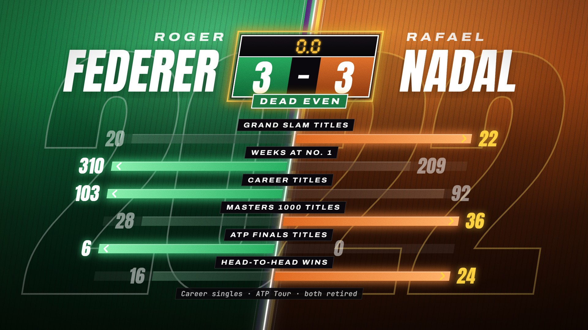

# Head to Head · `sports-head-to-head`


Two team-coloured halves slam shut on a diagonal seam, a VS badge lands on the impact and the names rise out
of the seam around it. One stat row at a time, diverging bars grow from the seam with counters riding their
tips; the winner of each row brightens and the loser dims. Then the VS flips into a buzzer scoreboard whose
tally, like every bar length and verdict, is computed from the params.

<!-- catalog:start · generated by tools/catalog.mjs from style.js; edit the style, then rerun -->
| | |
|---|---|
| **Style id** | `sports-head-to-head` |
| **Primary niches** | Sports · Basketball · GOAT debates |
| **Also fits** | Tennis · American football · Soccer · Boxing & MMA tale of the tape · Formula 1 drivers · Esports players · Tech spec face-offs |
| **Length** | 7.5 s · poster frame 7.1 s · 57 sound cues |
| **Palette** | `#CE1141` `#552583` `#FDB927` |
| **Techniques** | Diagonal split-screen slam · Diverging bars with live verdicts · VS badge flips into a buzzer scoreboard |

**Why it retains:** Every row is a small contest with a visible winner, so the viewer keeps score in their head until the buzzer confirms it.

**Retention beats** (the editing decisions, in order)

| t | beat |
|---:|---|
| 0.30 s | Both halves slam shut by frame 18: the matchup reads before any text |
| 0.70 s | VS lands on the impact; names rise out of the seam around it |
| 1.20 s | One scale per row, measured from the seam: both bars read true |
| 2.43 s | Winner brightens, loser dims: the verdict needs no reading |
| 5.00 s | VS flips into the scoreboard: the matchup becomes a result |
| 6.00 s | Buzzer on 0.0 closes the loop with a sound every fan knows |

**Showcase card:** Sports · *Head to Head*  
**Facts:** NBA career regular-season stats and honours (NBA.com, Basketball-Reference): Jordan 30.1 PPG, 32,292 pts, 6 titles, 5 MVPs, 14 All-Star; Bryant 25.0 PPG, 33,643 pts, 5 titles, 1 MVP, 18 All-Star.

**Examples**

| params | niche | title | frame |
|---|---|---|---|
| defaults | Sports | Head to Head |  |
| [`examples/tennis-federer-nadal.json`](examples/tennis-federer-nadal.json) | Tennis | Dead Even |  |

**Render**

```bash
node tools/render.mjs sheet sports-head-to-head
node tools/render.mjs video sports-head-to-head --params styles/sports-head-to-head/examples/tennis-federer-nadal.json
```

<details><summary>Default params (copy into a params file and change what you need)</summary>

```json
{
  "left": { "sub": "MICHAEL", "name": "JORDAN", "number": "23" },
  "right": { "sub": "KOBE", "name": "BRYANT", "number": "24" },
  "rows": [
    { "label": "POINTS PER GAME", "left": 30.1, "right": 25, "decimals": 1 },
    { "label": "CAREER POINTS", "left": 32292, "right": 33643 },
    { "label": "CHAMPIONSHIPS", "left": 6, "right": 5 },
    { "label": "MVP AWARDS", "left": 5, "right": 1 },
    { "label": "ALL-STAR SELECTIONS", "left": 14, "right": 18 }
  ],
  "vs": "VS",
  "finalLabel": "FINAL",
  "caption": "Career regular season · NBA",
  "colors": {
    "left": {
      "panel": ["#D8163F", "#A90E35", "#55081F", "#23050E", "#0D0207"],
      "sheen": "rgba(255,92,130,.42)",
      "number": "rgba(255,255,255,.3)",
      "numberFill": "rgba(0,0,0,.13)",
      "stripe": "#050304",
      "stripeLine": "rgba(255,255,255,.5)",
      "vs": "#9A0C31",
      "bar": ["#6A0821", "#BD103B"],
      "barWin": ["#D51540", "#FF5B80"],
      "barGlow": "rgba(255,48,96,.8)",
      "accent": "#FFFFFF",
      "valueGlow": "rgba(255,70,110,.85)",
      "plate": ["#E3194B", "#A30D34"]
    },
    "right": {
      "panel": ["#733AB4", "#542585", "#2B1149", "#160828", "#09040F"],
      "sheen": "rgba(253,185,39,.26)",
      "number": "rgba(253,185,39,.36)",
      "numberFill": "rgba(0,0,0,.15)",
      "stripe": "#FDB927",
      "stripeLine": "rgba(255,255,255,.42)",
      "vs": "#45217C",
      "bar": ["#33165A", "#6737A9"],
      "barWin": ["#7440BC", "#BC8DFF"],
      "barGlow": "rgba(178,120,255,.8)",
      "accent": "#FDB927",
      "valueGlow": "rgba(253,185,39,.6)",
      "plate": ["#6A35AA", "#3E1B6D"]
    },
    "spark": "#FDB927",
    "backdrop": ["#221328", "#0C0710", "#07040A"],
    "scoreboard": {
      "led": "#FF4034",
      "ring": "#FF3326",
      "glow": "#FF281E",
      "tag": "#E0231B",
      "flash": "#FF1E18"
    }
  }
}
```
</details>
<!-- catalog:end -->

## Params

| key | default | what it controls · limits |
|---|---|---|
| `left.name`, `right.name` | `JORDAN`, `BRYANT` | the big names either side of the badge. They shrink to fit (about 608 px on the left, 512 px on the right), and a shrunk name stays on the shared baseline. 5–9 letters read best |
| `left.sub`, `right.sub` | `MICHAEL`, `KOBE` | small line above each name (first name, city, brand). Shrinks with the same limits |
| `left.number`, `right.number` | `23`, `24` | huge outlined numbers in the background (jersey numbers, title counts, model numbers). 1–2 characters; `""` hides them |
| `rows` | 5 NBA career rows | **3–6 rows** (extra rows are cut at 6; 1–2 render but look thin). 5 rows use the showcase spacing (110 px apart, starting 0.65 s apart). 3–4 rows spread over the same band, up to 150 px apart and up to 0.9 s apart. 6 rows sit 88 px apart and shrink bars and values to 80%. The rows always start between 1.2 and 3.8 s, so the flip at 5.0 s follows the last verdict |
| `rows[].label` | `POINTS PER GAME` | tag above the row's bars. Up to about 24 characters; longer labels shrink |
| `rows[].left`, `rows[].right` | `30.1`, `25` | the two values. Each row's bars are drawn to scale against that row's larger value. Values must be ≥ 0 (a negative value draws no bar) |
| `rows[].decimals` | `0` (`1` on the first row) | decimals shown **and** judged: a row whose rounded values match is a tie |
| `rows[].prefix`, `rows[].suffix` | none | units around the counter (`$`, `%`, `" mAh"`). A value that would cross title-safe shrinks |
| `rows[].lowerIsBetter` | `false` | the smaller value wins (interceptions, ERA, lap time, price, weight). The bars stay to scale, and the verdict highlight shows who won |
| `vs` | `VS` | badge text. Up to 3 characters read best; longer text shrinks to 160 px |
| `finalLabel` | `FINAL` | tag under the scoreboard. `{leftScore}`, `{rightScore}`, `{left}` and `{right}` (the names) are filled in. Up to about 12 characters; it shrinks past 396 px, and `""` hides it |
| `caption` | `Career regular season · NBA` | scope and source line under the rows. Takes the same fill-ins; shrinks past 1100 px; `""` hides it |
| `colors.left.*`, `colors.right.*` | Bulls red; Lakers purple and gold | per side: `panel` (5 stops, top to bottom) · `sheen` (soft light at the top) · `number`, `numberFill` (outline and fill of the big number) · `stripe`, `stripeLine` (accent stripes on the seam edge) · `vs` (this side's end of the badge) · `bar` [seam, tip] · `barWin` [seam, tip] (winning bar) · `barGlow` · `accent` (winning value and chevron) · `valueGlow` · `plate` [top, bottom] (score plate) |
| `colors.spark` | `#FDB927` | VS sparks and the badge glow (hex) |
| `colors.backdrop` | `#221328` `#0C0710` `#07040A` | backdrop seen before the halves meet; the last stop also fills the stage |
| `colors.scoreboard.*` | buzzer reds | `led` (digits) · `ring` (the blinking buzzer light) · `glow` (ring and tag glow) · `tag` (FINAL tag fill) · `flash` (red edge flash on the buzzer). `led`, `glow` and `flash` must be hex; their alphas are derived |
| `palette`, `meta`, `bg` | from style.js | portfolio swatches, card copy (`niche`, `title`, `why`, `facts`), page background |

**Computed, never typed:** the winner of each row (`lowerIsBetter` and ties included), both bar lengths, the
counters, the loser dimming, the tally on the plates, which plate glints and which one dims. Ties score no
point: nothing dims and both bars glint. An overall tie glints both plates.

## Adapting it

- **Tennis** (the example, `examples/tennis-federer-nadal.json`): six frozen career stats for two retired
  players. The rows are ordered so the winner swaps sides almost every row and the buzzer lands on 3–3, with
  `finalLabel: "DEAD EVEN"`. It is re-skinned as grass against clay: green `colors.left`, terracotta
  `colors.right`, an amber scoreboard.
- **American football (retired QBs):** rows such as `SUPER BOWL WINS`, `TOUCHDOWN PASSES`, `PASSING YARDS`,
  `PASSER RATING` (`decimals: 1`) and `INTERCEPTIONS` (`lowerIsBetter: true`). Use jersey numbers in `number`
  and team colours per side.
- **Boxing and MMA tale of the tape:** `sub` holds the nickname, and `number` holds the total wins or `""`. Rows
  such as `HEIGHT` (`suffix: " cm"`), `REACH`, `KO WINS` and `LOSSES` (`lowerIsBetter: true`). Try
  `finalLabel: "ON PAPER"`.
- **Tech spec face-off:** `sub` holds the brand, `name` the model, and `number` is `""`. Rows such as
  `PRICE AT LAUNCH` (`prefix: "$"`, `lowerIsBetter: true`), `BATTERY` (`suffix: " mAh"`) and `WEIGHT`
  (`suffix: " g"`, `lowerIsBetter: true`). Use `finalLabel: "VERDICT"` and brand colours.
- **Formula 1 drivers:** rows such as `WORLD TITLES`, `RACE WINS`, `POLE POSITIONS` and `PODIUMS`, with team
  liveries in `colors.*`. `number` holds the car number.

## Limits

- Exactly two sides and 3–6 rows. Each row is its own contest: bars are comparable within a row, not across rows.
- The tally counts rows won. There is no weighting, and ties score nothing. The plates are built for a single
  digit, which 6 rows guarantee.
- Values must be ≥ 0. Very large numbers stay legible up to about 12 characters, including separators and
  units (`$134,946,100`), by shrinking.
- The scoreboard is a basketball-style shot clock (0.7 → 0.0 and a buzzer). Keep it for "final result"
  stories; the text and colours change, not the device.
- Stats go stale. Use frozen numbers (retired players, completed seasons, launch specs), and update
  `meta.facts` with sources whenever you change the rows.
