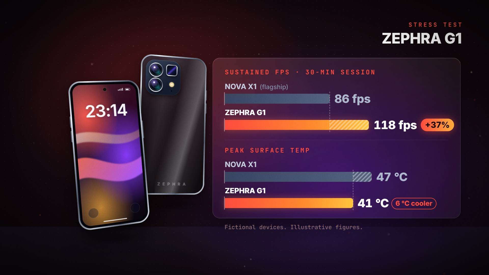

# Spec Callouts · `tech-spec-callouts`


The front and back of a fictional phone rise into a CSS 3D float while a light sweep crosses the glass.
A callout fires every half second; each leader line is projected from the phones' live 3D pose, so it
stays pinned to its feature while they drift, and the chip and battery callouts draw x-ray line art on
the back glass. The callouts fold away, the phones slide aside, and a glass panel races the benchmark
bars on one shared scale per section. The gap is drawn as a dashed guide plus a hatched surplus, and the
takeaway, computed from the data, lands as a badge on a ding.

<!-- catalog:start · generated by tools/catalog.mjs from style.js; edit the style, then rerun -->
| | |
|---|---|
| **Style id** | `tech-spec-callouts` |
| **Primary niches** | Tech reviews · Smartphone launches · Spec breakdowns |
| **Also fits** | Phone vs phone comparisons · Mobile gaming · Budget tech · Camera phone tests · Tech news recaps · Consumer tech explainers |
| **Length** | 7.5 s · poster frame 7 s · 74 sound cues |
| **Palette** | `#2DE2C9` `#8B7CFF` `#0C1426` |
| **Techniques** | CSS 3D product float with light sweeps · Leader lines projected from the 3D pose · Shared-scale benchmark race |

**Why it retains:** A new callout every half second walks the eye around the device, then the data panel lands one number, +38%, as the takeaway.

**Retention beats** (the editing decisions, in order)

| t | beat |
|---:|---|
| 0.00 s | Product rises into a 3D settle; a light sweep sells the glass |
| 1.00 s | One callout every half second walks the eye around the device |
| 2.00 s | X-ray line art shows what the spec means, not just the number |
| 3.60 s | Callouts clear before the data arrives: one idea at a time |
| 4.56 s | Bars race on one shared scale; the old model stops first |
| 5.41 s | +38% lands on the ding: the one number to remember |

**Showcase card:** Tech Reviews · *Spec Callouts*  
**Facts:** Fictional device, illustrative figures. +38% = 9,950 / 7,210 = 1.38; battery 26 h vs 21 h = +5 h.

**Examples**

| params | niche | title | frame |
|---|---|---|---|
| defaults | Tech Reviews | Spec Callouts |  |
| [`examples/gaming-phone.json`](examples/gaming-phone.json) | Mobile gaming | The Throttle Test |  |

**Render**

```bash
node tools/render.mjs sheet tech-spec-callouts
node tools/render.mjs video tech-spec-callouts --params styles/tech-spec-callouts/examples/gaming-phone.json
```

<details><summary>Default params (copy into a params file and change what you need)</summary>

```json
{
  "eyebrow": "FIRST LOOK",
  "device": "NOVA X1",
  "brand": "NOVA",
  "clock": "10:08",
  "callouts": [
    { "feature": "display", "label": "DISPLAY", "value": "6.3-inch 120 Hz OLED" },
    { "feature": "camera", "label": "CAMERA", "value": "50 MP periscope · 5× optical" },
    { "feature": "chip", "label": "PROCESSOR", "value": "3 nm chip" },
    { "feature": "battery", "label": "BATTERY", "value": "5,000 mAh" }
  ],
  "rival": { "name": "NOVA 9", "note": "(last gen)" },
  "benchmarks": [
    {
      "label": "MULTI-CORE SCORE",
      "ours": 9950,
      "rival": 7210,
      "unit": "",
      "decimals": 0,
      "higherIsBetter": true,
      "delta": "pct",
      "chip": "{delta}"
    },
    {
      "label": "BATTERY · VIDEO PLAYBACK",
      "ours": 26,
      "rival": 21,
      "unit": " h",
      "decimals": 0,
      "higherIsBetter": true,
      "delta": "diff",
      "chip": "{delta}"
    }
  ],
  "note": "Fictional device. Illustrative figures.",
  "padNotes": [196, 293.7, 370, 440],
  "background": "radial-gradient(60% 55% at 50% 45%, #0F182C 0%, #080D19 60%, #05080F 100%)",
  "colors": {
    "accent": "#2DE2C9",
    "ink": "#EAF1FF",
    "faint": "#5E6A86",
    "worse": "#FF7A7A",
    "glowA": "#1ED7C8",
    "glowB": "#8062FF",
    "grid": "#A0BEFF",
    "mote": "#AFC8FF",
    "bar": ["#1FD1BC", "#5E95FF", "#A07CFF"],
    "barGlow": "#50AAFF",
    "badgeEnd": "#7FE7FF",
    "badgeText": "#04121A",
    "back": ["#2E3B56", "#1B243A", "#0F1526"],
    "screen": ["#0C1C50", "#1C1048", "#060A1C"],
    "wallpaper": ["#2CECD2", "#8B6EFF", "#FF5CAA"],
    "ribbons": ["#2CECD2", "#9B7BFF", "#FF6FB5"]
  }
}
```
</details>
<!-- catalog:end -->

## Params

Every difference on screen (the takeaway badge, the chips, which bar is hatched, which bar stops first)
is computed from the benchmark numbers. The length stays 7.5 s for any content.

| key | default | what it controls · limits |
|---|---|---|
| `eyebrow` | `FIRST LOOK` | mono label above the device name, top right. Shrinks past 640 px; `""` hides it |
| `device` | `NOVA X1` | the lockup and the "ours" rows. Shrinks past 640 px |
| `brand` | `NOVA` | wordmark on the back glass. Shrinks to fit; 4–8 letters look right |
| `clock` | `10:08` | lock-screen clock on the front phone. Shrinks to fit the screen |
| `callouts` | display · camera · chip · battery | 1–4 callouts, a new one every 0.5 s in list order. Each feature can be used once (repeats are dropped). They all retract at 3.6 s |
| `callouts[].feature` | see defaults | where the leader line lands: `display` (front screen, label left), `camera` (periscope lens, label top left), `chip` (processor, label right) or `battery` (battery, label right). `chip` and `battery` draw x-ray art on the back glass; the battery also fills up |
| `callouts[].label` | `DISPLAY`, … | mono category label on the card. Shrinks to fit the card |
| `callouts[].value` | `6.3-inch 120 Hz OLED`, … | the spec line. It wipes in left to right, shrinks up to 20 % when long, then wraps to two balanced lines. About 50 characters is the practical maximum |
| `callouts[].icon` | the feature's icon | `display`, `camera`, `chip`, `battery`, `bolt`, `fan` or `speaker` |
| `callouts[].xray` | `true` | `false` turns off the chip or battery line art for that callout |
| `rival.name`, `rival.note` | `NOVA 9`, `(last gen)` | the comparison device in every section. The note shows on the first section only |
| `benchmarks` | multi-core score, battery life | 1–2 sections. The first is the takeaway: a filled badge on a ding. Later sections get an outline chip. With one section the panel shrinks around it and stays centred |
| `benchmarks[].label` | `MULTI-CORE SCORE`, … | the typed header. Shrinks past 852 px |
| `benchmarks[].ours`, `.rival` | `9950` vs `7210`, `26` vs `21` | the two values, both > 0. The longer bar fills the section's scale |
| `benchmarks[].unit`, `.prefix`, `.decimals` | `''` / `' h'`, `''`, `0` | value formatting: `prefix` + number with thousands separators + `unit`. Put the space inside the unit (`" fps"`) |
| `benchmarks[].higherIsBetter` | `true` | decides whether ours is the better value. A worse result turns the badge or chip `colors.worse` |
| `benchmarks[].delta` | `pct`, `diff` | `pct`: change against the rival, rounded to a whole percent (+38 %). `diff`: the difference in units (+5 h) |
| `benchmarks[].chip` | `{delta}` | badge/chip text. `{delta}` is signed (`+38%`, `−6 °C`); `{abs}` is unsigned, for lines like `"{abs} cooler"` or `"{abs} cheaper"` |
| `note` | `Fictional device. Illustrative figures.` | footer under the panel. Say where real numbers come from |
| `padNotes` | `[196, 293.7, 370, 440]` | the pad under the piece (Hz), a bright major chord |
| `background` | navy radial gradient | CSS backdrop behind the phones |
| `colors.accent` | `#2DE2C9` | callout dots and icons, x-ray art, eyebrow, headers, badge start, chips |
| `colors.bar`, `.barGlow` | teal → blue → violet, `#50AAFF` | the "ours" bar gradient (3 stops) and its glow |
| `colors.badgeEnd`, `.badgeText` | `#7FE7FF`, `#04121A` | the takeaway badge gradient end and text |
| `colors.worse` | `#FF7A7A` | badge or chip colour when ours is the worse value |
| `colors.screen`, `.wallpaper`, `.ribbons` | navy, teal/violet/pink | lock-screen gradient, its three colour blobs and the two ribbons (3 colours each) |
| `colors.back` | slate gradient | back glass (3 stops) |
| `colors.*` | see defaults | `ink` card text · `faint` footer · `glowA`/`glowB` the drifting backdrop glows · `grid` dot grid · `mote` dust |
| `palette`, `meta`, `bg` | from style.js | portfolio swatches, card copy (`niche`, `title`, `why`, `facts`), page background |

## Adapting it

- **Mobile gaming** ([`examples/gaming-phone.json`](examples/gaming-phone.json)): a fictional gaming
  phone against the default's fictional flagship. The `chip` callout becomes `COOLING` with the `fan`
  icon. The takeaway is sustained FPS (`delta: "pct"`) and the second section is surface temperature with
  `higherIsBetter: false` and `chip: "{abs} cooler"`, so the hatch falls on the hotter rival. Red,
  violet and amber replace the teal look.
- **Phone vs phone comparison:** set `rival.name` to the competitor and `rival.note` to `(rival)`. Real
  benchmark numbers need a source in `note` and in `meta.facts`.
- **Budget tech:** lead with a win such as battery life, then a price section with `prefix: "$"`,
  `higherIsBetter: false`, `delta: "diff"` and `chip: "{abs} cheaper"`.
- **Camera phone tests:** put `camera` first, make the other callouts about the imaging pipeline
  (`chip` → `IMAGE CHIP`), and use sections like `LOW-LIGHT SCORE` and `ZOOM SHARPNESS`.

## Limits

- The product is always a phone, front and back. Tablets, watches, laptops and GPUs need a different
  device model, so PC or GPU benchmark videos don't fit (the panel alone would).
- Four anchor features, each used once. There are no anchors on the frame, buttons or ports.
- 1–2 benchmark sections with values above zero. The first section is the takeaway and the ding
  celebrates it, so lead with a win.
- Values up to about 6 characters, unit included, keep full-length bars next to the takeaway badge (about 8
  next to a chip). Longer values shorten the bars to make room, and extreme ones also shrink the numbers.
- Numbers are illustrative unless you source them. Keep `note` honest and update `meta.facts` with the
  maths whenever the numbers change.
