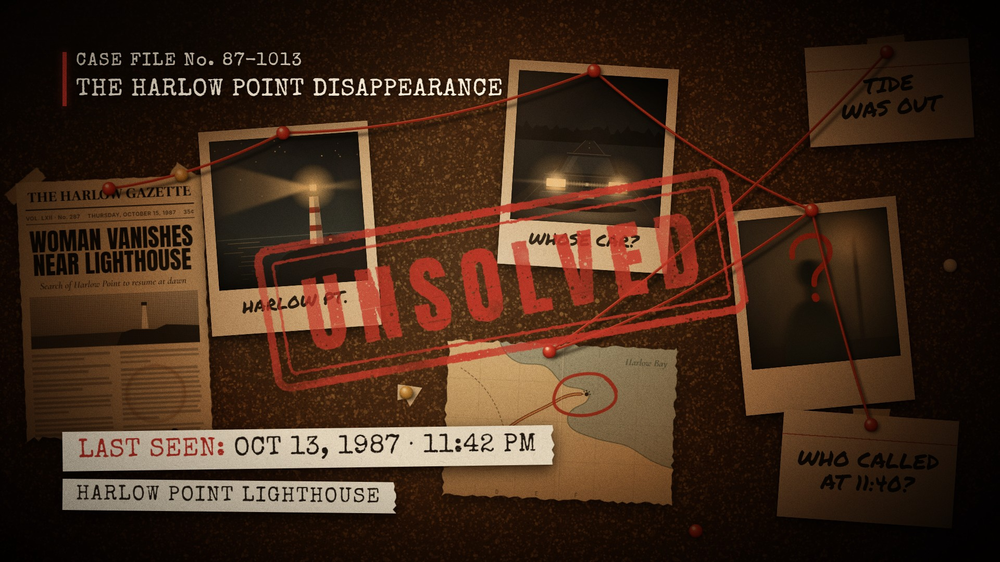
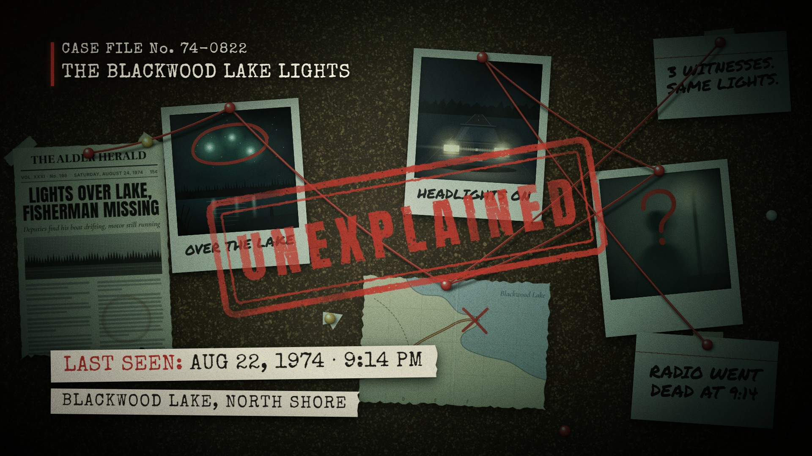

# Case Board · `truecrime-case-board`



A rostrum camera opens tight on one photo with a focus pull and a shutter flash, then rides a red string from
pin to pin across a cork board. Marker marks are drawn on the clues as each pin lands. The camera then pulls
out to show the whole board while more strings snap in. A typewriter lower third answers when and where, and a
stamp slams onto the board with a shake, a dust puff and a swinging desk lamp. Every word on the board, the
photo subjects, the order the string visits them and the colours come from the params; the layout, camera and
sound are authored.

<!-- catalog:start · generated by tools/catalog.mjs from style.js; edit the style, then rerun -->
| | |
|---|---|
| **Style id** | `truecrime-case-board` |
| **Primary niches** | True crime · Cold cases · Missing persons |
| **Also fits** | Unsolved mysteries · Paranormal & UFO · Heists & fraud · Conspiracy & cover-ups · Historical mysteries · Mystery podcasts · Crime fiction & ARGs |
| **Length** | 8.0 s · poster frame 7.6 s · 132 sound cues |
| **Palette** | `#B3261E` `#ECE3CF` `#1C130C` |
| **Techniques** | Rostrum camera rides the string · Two-colour typewriter lower third · Stamp slam with dust and lamp sway |

**Why it retains:** The string gives the eye one path to follow, every stop pays off with a new clue, and the stamp poses the question the video promises to answer.

**Retention beats** (the editing decisions, in order)

| t | beat |
|---:|---|
| 0.00 s | Open tight on one photo; focus pull and shutter start the clock |
| 0.78 s | Camera rides the red string, so the eye never has to search |
| 3.60 s | Pull-out shows the whole board at once: the scale of the case |
| 4.46 s | Typed lower third answers when and where |
| 6.40 s | Stamp slam lands the hook; shake, dust and lamp sway sell the weight |
| 6.50 s | Slow push on the stamp holds the question open |

**Showcase card:** True Crime · *The Case Board*  
**Facts:** Fictional case: the case number, Harlow Point, the Harlow Gazette and every date and time are invented for this piece.

**Examples**

| params | niche | title | frame |
|---|---|---|---|
| defaults | True Crime | The Case Board |  |
| [`examples/blackwood-lake-lights.json`](examples/blackwood-lake-lights.json) | Unsolved mysteries | The Blackwood Lake Lights |  |

**Render**

```bash
node tools/render.mjs sheet truecrime-case-board
node tools/render.mjs video truecrime-case-board --params styles/truecrime-case-board/examples/blackwood-lake-lights.json
```

<details><summary>Default params (copy into a params file and change what you need)</summary>

```json
{
  "caseFile": "CASE FILE No. 87-1013",
  "caseTitle": "THE HARLOW POINT DISAPPEARANCE",
  "newspaper": {
    "name": "THE HARLOW GAZETTE",
    "issue": "VOL. LXII · No. 287",
    "date": "THURSDAY, OCTOBER 15, 1987",
    "price": "35¢",
    "headline": "WOMAN VANISHES\nNEAR LIGHTHOUSE",
    "subhead": "Search of Harlow Point to resume at dawn",
    "photo": "lighthouse"
  },
  "photos": [
    { "type": "lighthouse", "caption": "HARLOW PT.", "mark": "" },
    { "type": "car", "caption": "WHOSE CAR?", "mark": "" },
    { "type": "figure", "caption": "", "mark": "question" }
  ],
  "map": { "place": "HARLOW POINT", "water": "Harlow Bay", "mark": "circle" },
  "cards": ["WHO CALLED\nAT 11:40?", "TIDE\nWAS OUT"],
  "route": ["photo1", "photo2", "photo3", "map"],
  "links": { "newspaper": "photo1", "card1": "photo3", "card2": "map" },
  "lowerThird": {
    "label": "LAST SEEN:",
    "detail": "OCT 13, 1987 · 11:42 PM",
    "place": "HARLOW POINT LIGHTHOUSE"
  },
  "stamp": "UNSOLVED",
  "background": "#0A0604",
  "colors": {
    "accent": "#B3261E",
    "string": "#B0231A",
    "stringLight": "#FF8C7C",
    "marker": "#C22A1F",
    "stamp": "#CC3326",
    "caseFile": "#EFE4CC",
    "caseTitle": "#FFF3DC",
    "paper": "#ECE3CF",
    "ink": "#1D1813",
    "grade": "#6B4420",
    "lamp": ["#FFF3DE", "#F0CC9C", "#A87448", "#422919", "#120B07"],
    "lampGlow": ["#FFBA6E", "#FFA05A"],
    "cork": {
      "base": "#3B2515",
      "flecks": ["#5A3C22", "#6A472A", "#7A5431", "#482E1A", "#86603A", "#33200F", "#94703F"],
      "dark": "#170C05",
      "light": "#B38A54"
    }
  }
}
```
</details>
<!-- catalog:end -->

## Params

The board has seven fixed slots. `photo1` sits left of centre, `photo2` top centre, `photo3` right and `map`
bottom centre; these four are the string's stops. The `newspaper` is on the far left, `card1` bottom right and
`card2` top right.

| key | default | what it controls · limits |
|---|---|---|
| `caseFile` | `CASE FILE No. 87-1013` | typed header, line 1. Shrinks past 1000 px. A long line types faster, so it is done by about 1.3 s |
| `caseTitle` | `THE HARLOW POINT DISAPPEARANCE` | typed header, line 2. The typist pauses before the last word, so the pin landing at 1.62 s sits alone in the mix. Shrinks past 1000 px (about 34 characters at full size) and types faster when needed to finish by 3.0 s |
| `newspaper.name` | `THE HARLOW GAZETTE` | masthead. Shrinks past the 298 px column (about 18 characters at full size) |
| `newspaper.issue`, `.date`, `.price` | `VOL. LXII · No. 287`, `THURSDAY, OCTOBER 15, 1987`, `35¢` | dateline row; the three items shrink together |
| `newspaper.headline` | `WOMAN VANISHES\nNEAR LIGHTHOUSE` | 1–3 lines, broken with `\n`. About 15 characters per line at full size; it shrinks to fit the column, and 3 lines shrink to keep the photo on the page |
| `newspaper.subhead` | `Search of Harlow Point to resume at dawn` | italic dek. Shrinks past 298 px |
| `newspaper.photo` | `lighthouse` | halftone strip under the headline: `lighthouse` · `shore` · `house` · `city` · `none` |
| `photos` | lighthouse, car, figure | **exactly 3** polaroids: `photo1`, `photo2`, `photo3`. A missing entry becomes an unexposed print |
| `photos[].type` | `lighthouse`, `car`, `figure` | the illustration: `lighthouse` · `car` (headlights on a night road) · `figure` (a blurred figure under a streetlamp) · `lights` (lights over a lake, a witness on the dock) · `house` (lone house, one lit window) · `document` (a typed page with redactions) · `blank` (unexposed print). An unknown type becomes `blank` |
| `photos[].caption` | `HARLOW PT.`, `WHOSE CAR?`, `""` | marker caption under the photo. Shrinks past 264 px (about 14 characters); `""` hides it |
| `photos[].mark` | `""`, `""`, `question` | red marker drawn on just after the photo's pin lands: `question` · `circle` · `cross` · `""`. Circles and crosses land on the photo's subject (the lit window, the headlights, the lights) |
| `map.place`, `map.water` | `HARLOW POINT`, `Harlow Bay` | map labels. The geography is fixed: a shoreline with a road running out to a point. `place` shrinks past 190 px; `water` shrinks past 120 px and slides left |
| `map.mark` | `circle` | mark on the point: `circle` · `cross` · `question` · `""` |
| `cards` | `WHO CALLED\nAT 11:40?`, `TIDE\nWAS OUT` | the index cards `[card1, card2]`. Use `\n` for line breaks: 1–3 short lines of about 12 characters. Text shrinks to the card, and a single line sits mid-card |
| `route` | `photo1`, `photo2`, `photo3`, `map` | the order the camera rides the string: any order of the four stops. Anything else falls back to the default |
| `links` | `newspaper: photo1`, `card1: photo3`, `card2: map` | which stop each pull-out string starts from (`photo1` · `photo2` · `photo3` · `map`) |
| `lowerThird.label`, `.detail` | `LAST SEEN:`, `OCT 13, 1987 · 11:42 PM` | first typed strip: the red label, then the detail in ink. Shrinks past 1000 px of text |
| `lowerThird.place` | `HARLOW POINT LIGHTHOUSE` | second typed strip. Shrinks past 1000 px; `""` hides it. Long strips type faster, so the ding always lands before the stamp |
| `stamp` | `UNSOLVED` | the stamped word. Shrinks, letter-spacing included, past 760 px (about 8 letters at full size) and stays centred in the frame |
| `background` | `#0A0604` | stage colour behind the board |
| `colors.accent` | `#B3261E` | header tab and the lower-third label (hex) |
| `colors.string`, `colors.stringLight` | `#B0231A`, `#FF8C7C` | the string and its highlight |
| `colors.marker`, `colors.stamp` | `#C22A1F`, `#CC3326` | marker ink (photo and map marks) and stamp ink |
| `colors.caseFile`, `colors.caseTitle` | `#EFE4CC`, `#FFF3DC` | the two header lines |
| `colors.paper`, `colors.ink` | `#ECE3CF`, `#1D1813` | lower-third paper and type |
| `colors.grade` | `#6B4420` | colour grade blended over the frame at 14% |
| `colors.lamp` | 5 warm stops | the desk-lamp pool, centre to edge, multiplied over the board. It is the biggest mood control (hex) |
| `colors.lampGlow` | `#FFBA6E`, `#FFA05A` | the lamp's soft glow (hex) |
| `colors.cork.*` | cork browns | `base`, `flecks` (7 colours), and `dark` and `light` specks of the generated cork |
| `palette`, `meta`, `bg` | from style.js | portfolio swatches, card copy (`niche`, `title`, `why`, `facts`), page background |

## Adapting it

- **Unsolved mysteries and paranormal** (the example, `examples/blackwood-lake-lights.json`): `photo1` is
  `lights` with a `circle`, and the map gets a `cross`. The route becomes `photo1 → map → photo3 → photo2`.
  The stamp reads `UNEXPLAINED` and the newspaper photo is `shore`. A cold lamp (`colors.lamp`, `lampGlow`) and a
  teal `grade` keep the red string and stamp popping.
- **Heists and fraud:** photos `document` (`cross`), `car` (`GETAWAY CAR?`) and `figure` (`INSIDE MAN?`),
  with `newspaper.photo: "city"`. Set `lowerThird.label` to `VAULT OPENED:` and try `stamp: "UNRECOVERED"`.
- **Cold cases and historical mysteries:** keep the warm grade, set the dates to the era, and use
  `newspaper.photo: "house"` or `"shore"`. Try `stamp: "COLD CASE"`, and skip `car` for stories set before the 1970s.
- **Conspiracies and cover-ups:** `document` with a `circle`, `blank` for the photo that went missing, and
  `stamp: "CLASSIFIED"` or `"REDACTED"` in a black or blue `colors.stamp`, under a colder lamp.
- **Crime fiction and mystery podcasts:** invent freely, set `stamp: "CASE CLOSED"` for a finale, and point
  `links` at the clue that cracks it.

## Limits

- The layout is authored: seven items, their positions, sizes and pins, and the map's coastline. Params change
  what is on them, not where they are.
- There are exactly 3 photos, chosen from 7 built-in vector illustrations. There are no photo uploads, which
  keeps every frame deterministic.
- Text shrinks rather than wraps, except at explicit `\n`, so very long lines get small. Aim for the
  character counts above.
- Photo types draw different amounts of the seeded randomness, so changing one shifts the later tape tears,
  newspaper columns and dust slightly. That is expected, and only the defaults are pinned. Text, route, links
  and colours never change the random layout.
- Keep cases fictional, or verified and respectful. Never use real victims or open real cases; say so in
  `meta.facts`.
